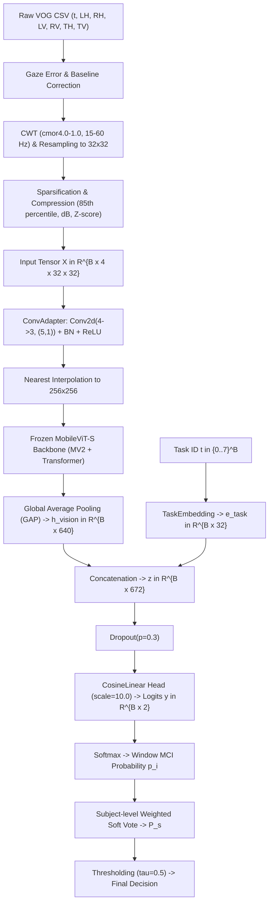

# VOG 기반 MCI 탐지 모델 수학적 정식화

Video Oculography(VOG) signal로부터 경도인지장애(MCI)를 판정하는 모델의 input 생성, layer 별 수학적 변환 방식, 및 피험자 단위 판정 과정을 알아보고 정리했습니다.

## 1. 전체 파이프라인 개요

---

## 2. 입력 노테이션 및 시계열 전처리

### 2.1 원본 신호 및 오차 벡터
샘플링 레이트 $f_s \approx 120\,\text{Hz}$에서 자극 변화 이벤트 시점 $t_{\text{event}}$ 기준 1.0초 구간($t \in [t_{\text{event}} - 0.2, \, t_{\text{event}} + 0.8]\,\text{s}$):
- 좌안 시선 좌표: $(x_{LH}(t), y_{LV}(t)) \in \mathbb{R}^2$
- 우안 시선 좌표: $(x_{RH}(t), y_{RV}(t)) \in \mathbb{R}^2$
- 목표물 위치 좌표: $(x_{TH}(t), y_{TV}(t)) \in \mathbb{R}^2$

Anti-saccade task인 task ID 2, 6의 경우 주 과제 축 목표 위치를 반전 처리

$$x_{T,\text{task}}(t) \leftarrow - x_{T,\text{task}}(t)$$

좌우안의 수평(H) 및 수직(V) 4개 오차 신호 $e_c(t)$ ($c \in \{LH, RH, LV, RV\}$):
$$e_{LH}(t) = x_{LH}(t) - x_{TH}(t)$$
$$e_{RH}(t) = x_{RH}(t) - x_{TH}(t)$$
$$e_{LV}(t) = x_{LV}(t) - x_{TV}(t)$$
$$e_{RV}(t) = x_{RV}(t) - x_{TV}(t)$$

### 2.2 사전 자극 구간 베이스라인 보정
자극 전 $0.2\,\text{s}$ ($N_{\text{pre}} = \lfloor 0.2 \cdot f_s \rfloor$ 샘플) 구간의 평균값을 뺌
$$\bar{e}_c(t) = e_c(t) - \frac{1}{N_{\text{pre}}} \sum_{k=1}^{N_{\text{pre}}} e_c(t_k)$$

### 2.3 Artifact Rejection
주 과제 축(Horizontal 과제는 LH/RH, Vertical 과제는 LV/RV)의 오차 최댓값이 임계값($\theta_{\text{artifact}} = 30.0^\circ$ 또는 $45.0^\circ$)을 초과할 경우 해당 윈도우를 기각
$$\max_t |\bar{e}_{\text{task}, L}(t)| > \theta_{\text{artifact}} \quad \lor \quad \max_t |\bar{e}_{\text{task}, R}(t)| > \theta_{\text{artifact}} \implies \text{Reject}$$

### 2.4 Continuous Wavelet Transform, CWT
- 모체 웨이블릿 (Complex Morlet, `cmor4.0-1.0`):
  $$\psi(t) = \pi^{-1/4} e^{i 2\pi f_0 t} e^{-t^2 / 2} \quad (f_0 = 1.0\,\text{Hz})$$
- 주파수 그리드 ($F = 32$, $15\,\text{Hz} \sim 60\,\text{Hz}$ 로그 등간격):
  $$f_k = 10^{\log_{10}(15) + \frac{k}{31} (\log_{10}(60) - \log_{10}(15))}, \quad k \in \{0, 1, \dots, 31\}$$
- 스케일 파라미터 $a_k$:
  $$a_k = \frac{f_0 \cdot f_s}{f_k}$$
- CWT 계수 적분:
  $$W_c(a_k, \tau) = \frac{1}{\sqrt{a_k}} \int_{-\infty}^{\infty} \bar{e}_c(t) \, \psi^*\left(\frac{t - \tau}{a_k}\right) dt \in \mathbb{C}$$
- 최근접 이웃 리샘플링을 통해 시간 축을 $T = 32$개 구간으로 변환하여 복소 텐서 $C_c \in \mathbb{C}^{32 \times 32}$를 획득

### 2.5 희소화 및 압축 (Sparsification & Compression)
1. 진폭 산출:
   $$M_c(f, t) = |C_c(f, t)| = \sqrt{\text{Re}(C_c(f, t))^2 + \text{Im}(C_c(f, t))^2}$$
2. 상위 15% 임계치 설정 (85th percentile threshold):
   $$\theta_{85, c} = \text{Percentile}(M_c, 85)$$
   $$\tilde{M}_c(f, t) = \begin{cases} M_c(f, t), & M_c(f, t) \ge \theta_{85, c} \\ 10^{-3}, & M_c(f, t) < \theta_{85, c} \end{cases}$$
3. 포화 데시벨 스케일 변환:
   $$S_c(f, t) = 10 \log_{10} \tilde{M}_c(f, t)$$
4. 표준화 (Z-score):
   $$Z_c(f, t) = \frac{S_c(f, t) - \mu_c}{\sigma_c + 10^{-8}}$$
   여기서 $\mu_c$ 및 $\sigma_c$는 단일 윈도우 내 $32 \times 32$ 격자의 평균 및 표준편차.

최종 입력 텐서:
$$\mathbf{X} = \begin{bmatrix} Z_{LH} \\ Z_{RH} \\ Z_{LV} \\ Z_{RV} \end{bmatrix} \in \mathbb{R}^{4 \times 32 \times 32}$$
배치 입력 텐서 $\mathbf{X} \in \mathbb{R}^{B \times 4 \times 32 \times 32}$ 및 과제 식별자 벡터 $\mathbf{t} \in \{0, 1, \dots, 7\}^B$.

---

## 3. 신경망 아키텍처 및 layer 별 수식

### 3.1 Layer 1: 비대칭 공간 어댑터 (`ConvAdapter`)
CWT의 수직축(temporal transient) 특이 신호를 강조하고 수평축(주파수 해상도)을 보존하기 위해 비대칭 커널 $(5, 1)$ 및 패딩 $(2, 0)$을 적용합니다.

- 2D Convolution:
  $$\mathbf{U}_{b, c_{\text{out}}, i, j} = \sum_{c_{\text{in}}=0}^{3} \sum_{m=-2}^{2} \mathbf{X}_{b, c_{\text{in}}, i+m, j} \cdot \mathbf{W}^{\text{adapt}}_{c_{\text{out}}, c_{\text{in}}, m+2, 0} + b^{\text{adapt}}_{c_{\text{out}}}$$
  $$\mathbf{U} \in \mathbb{R}^{B \times 3 \times 32 \times 32}$$
- Batch Normalization 및 ReLU:
  $$\hat{\mathbf{U}}_{b, c, i, j} = \frac{\mathbf{U}_{b, c, i, j} - \mu_{c}^{\text{BN}}}{\sqrt{(\sigma_{c}^{\text{BN}})^2 + \epsilon}} \cdot \gamma_c + \beta_c$$
  $$\mathbf{X}_{\text{adapt}} = \max(0, \hat{\mathbf{U}}) \in \mathbb{R}^{B \times 3 \times 32 \times 32}$$

### 3.2 Layer 2: 최근접 이웃 업샘플링 (8배 확대)
수직 에지 그래디언트의 보존을 위해 보간 모드를 `nearest`로 고정합니다:
$$\mathbf{X}_{\text{up}} = \text{Interpolate}_{\text{nearest}}(\mathbf{X}_{\text{adapt}}, \text{size}=(256, 256)) \in \mathbb{R}^{B \times 3 \times 256 \times 256}$$
$$\mathbf{X}_{\text{up}}(b, c, y, x) = \mathbf{X}_{\text{adapt}}\left(b, c, \left\lfloor \frac{y}{8} \right\rfloor, \left\lfloor \frac{x}{8} \right\rfloor \right)$$

### 3.3 Layer 3: 사전 학습 동결 백본 (`FrozenMobileViTBackbone`)
백본 파라미터는 동결 상태($\nabla_\theta = \mathbf{0}$)입니다.

#### (1) Inverted Residual MV2 블록 연산
입력 $\mathbf{F} \in \mathbb{R}^{B \times C_{\text{in}} \times H \times W}$, 확장 비율 $e$, 스트라이드 $s$:
1. $1\times 1$ Pointwise Conv (채널 확장):
   $$\mathbf{F}_1 = \text{Swish}(\text{BN}(\text{Conv}_{1\times 1}(\mathbf{F}))) \in \mathbb{R}^{B \times (e \cdot C_{\text{in}}) \times H \times W}$$
2. $3\times 3$ Depthwise Conv (공간 컨볼루션):
   $$\mathbf{F}_2 = \text{Swish}(\text{BN}(\text{DWConv}_{3\times 3}(\mathbf{F}_1))) \in \mathbb{R}^{B \times (e \cdot C_{\text{in}}) \times \frac{H}{s} \times \frac{W}{s}}$$
3. $1\times 1$ Pointwise Linear Conv (채널 축소):
   $$\mathbf{F}_3 = \text{BN}(\text{Conv}_{1\times 1}(\mathbf{F}_2)) \in \mathbb{R}^{B \times C_{\text{out}} \times \frac{H}{s} \times \frac{W}{s}}$$
4. 잔차 연결:
   $$\mathbf{F}_{\text{MV2}} = \begin{cases} \mathbf{F} + \mathbf{F}_3, & s = 1 \ \land \ C_{\text{in}} = C_{\text{out}} \\ \mathbf{F}_3, & \text{otherwise} \end{cases}$$

#### (2) MobileViT 블록 (Local-Global Transformer) 연산
입력 $\mathbf{F}_{\text{in}} \in \mathbb{R}^{B \times C \times H \times W}$, 패치 크기 $p=2$, 패치 내 원소 수 $P = p^2 = 4$, 토큰 수 $N = \frac{HW}{P}$:
1. 국소 표현 (Local Representation):
   $$\mathbf{F}_L = \text{Conv}_{1\times 1}(\text{Swish}(\text{BN}(\text{Conv}_{3\times 3}(\mathbf{F}_{\text{in}})))) \in \mathbb{R}^{B \times d \times H \times W}$$
2. 언폴딩 (Unfold):
   $$\mathbf{F}_U = \text{Unfold}(\mathbf{F}_L) \in \mathbb{R}^{B \times P \times N \times d}$$
3. 전역 셀프 어텐션 (Global Multi-Head Self-Attention):
   $P$개의 각 그리드에 대해 독립적으로 $L$개 층의 Transformer 인코더 적용:
   $$\mathbf{F}_G = \text{TransformerLayer}^L(\mathbf{F}_U) \in \mathbb{R}^{B \times P \times N \times d}$$
   $$\text{Attention}(\mathbf{Q}, \mathbf{K}, \mathbf{V}) = \text{softmax}\left(\frac{\mathbf{Q} \mathbf{K}^\top}{\sqrt{d_k}}\right) \mathbf{V}$$
4. 폴딩 (Fold):
   $$\mathbf{F}_{\text{fold}} = \text{Fold}(\mathbf{F}_G) \in \mathbb{R}^{B \times d \times H \times W}$$
5. 채널 투영 및 융합 (Pointwise Conv + Concat + Fusion Conv):
   $$\mathbf{F}_{\text{proj}} = \text{Swish}(\text{BN}(\text{Conv}_{1\times 1}(\mathbf{F}_{\text{fold}}))) \in \mathbb{R}^{B \times C \times H \times W}$$
   $$\mathbf{F}_{\text{fused}} = \text{Conv}_{3\times 3}([\mathbf{F}_{\text{in}} \,\|\, \mathbf{F}_{\text{proj}}]) \in \mathbb{R}^{B \times C \times H \times W}$$

#### (3) 백본 스테이지 구성
| 단계 | 연산 구성 | 출력 차원 |
|---|---|---|
| Stem | $\text{Conv}_{3\times 3}$ (stride=2) | $[B, 16, 128, 128]$ |
| Stage 1 | MV2 ($16 \to 32$, stride=1) | $[B, 32, 128, 128]$ |
| Stage 2 | MV2 ($32 \to 48$, stride=2) + MV2 ($48 \to 48$) | $[B, 48, 64, 64]$ |
| Stage 3 | MV2 ($48 \to 64$, stride=2) + MobileViT ($L=2, d=96$) | $[B, 64, 32, 32]$ |
| Stage 4 | MV2 ($64 \to 80$, stride=2) + MobileViT ($L=4, d=120$) | $[B, 80, 16, 16]$ |
| Stage 5 | MV2 ($80 \to 96$, stride=2) + MobileViT ($L=3, d=144$) | $[B, 96, 8, 8]$ |
| Head | $\text{Conv}_{1\times 1}$ ($96 \to 640$) | $[B, 640, 8, 8]$ |

#### (4) 전역 평균 풀링 (Global Average Pooling, GAP)
마지막 공간 해상도 $8 \times 8$을 평균합니다:
$$\mathbf{h}_{\text{vision}}(b, c) = \frac{1}{64} \sum_{h=1}^{8} \sum_{w=1}^{8} \mathbf{F}_{\text{last}}(b, c, h, w)$$
$$\mathbf{h}_{\text{vision}} \in \mathbb{R}^{B \times 640}$$

### 3.4 Layer 4: 과제 임베딩 계층 (`TaskEmbedding`)
과제 인덱스 $t \in \{0, 1, \dots, 7\}$에 대한 학습 가능 임베딩 테이블 $\mathbf{E} \in \mathbb{R}^{8 \times 32}$:
$$\mathbf{e}_{\text{task}} = \mathbf{E}[t] \in \mathbb{R}^{B \times 32}$$

### 3.5 Layer 5: 특성 결합 (Feature Concatenation)
$$\mathbf{z} = [\mathbf{h}_{\text{vision}} \,\|\, \mathbf{e}_{\text{task}}] \in \mathbb{R}^{B \times 672}$$

### 3.6 Layer 6: 드롭아웃 (`Dropout`)
드롭아웃 확률 $p = 0.3$:
$$\tilde{\mathbf{z}} = \begin{cases} \mathbf{z} \odot \mathbf{m} \cdot \frac{1}{1-p}, & \text{Training} \quad (m_j \sim \text{Bernoulli}(1-p)) \\ \mathbf{z}, & \text{Inference} \end{cases}$$

### 3.7 Layer 7: 코사인 선형 분류 헤드 (`CosineLinear`)
클래스 프로토타입 행렬 $\mathbf{W} \in \mathbb{R}^{2 \times 672}$ ($\mathbf{w}_0$: HC, $\mathbf{w}_1$: MCI), 고정 스케일 $s = 10.0$:
- $\ell_2$ 정규화:
  $$\hat{\mathbf{z}} = \frac{\tilde{\mathbf{z}}}{\|\tilde{\mathbf{z}}\|_2}, \quad \hat{\mathbf{w}}_c = \frac{\mathbf{w}_c}{\|\mathbf{w}_c\|_2} \quad (c \in \{0, 1\})$$
- Logits 산출:
  $$y_c = s \cdot (\hat{\mathbf{z}}^\top \hat{\mathbf{w}}_c) = s \cdot \cos(\theta_c), \quad c \in \{0, 1\}$$
  $$\mathbf{y} = [y_0, y_1]^\top \in \mathbb{R}^{B \times 2}$$

### 3.8 Layer 8: 윈도우 단위 사후 확률 (`Softmax`)
$$p_i = P(\text{MCI} \mid \mathbf{X}_i, t_i) = \frac{e^{y_1}}{e^{y_0} + e^{y_1}} = \frac{1}{1 + e^{-(y_1 - y_0)}}$$

---

## 4. 피험자 단위 진단 판정 (Inference Aggregation)

참조 소스: [repetitive_validator.py](file:///c:/Users/USER/MCI-VOG/src/four_error_using/evaluators/repetitive_validator.py)

피험자 $s$의 전체 유효 윈도우 인덱스 집합 $\mathcal{W}_s = \{1, 2, \dots, M_s\}$, 각 윈도우 $i \in \mathcal{W}_s$의 과제 종류 $t_i \in \{0, \dots, 7\}$:

### 4.1 과제별 가중 소프트 보팅 (Weighted Soft Vote)
$$\mathbf{w}_{\text{vote}} = [w_0, w_1, \dots, w_7] = [0.0, \, 0.0, \, 0.0, \, 1.5, \, 0.0, \, 1.5, \, 3.0, \, 2.5]$$
$$P_s = \frac{\sum_{i \in \mathcal{W}_s} w_{t_i} \cdot p_i}{\sum_{i \in \mathcal{W}_s} w_{t_i}}$$

### 4.2 최종 진단 라벨 판정
기준 임계값 $\tau = 0.5$:
$$\hat{Y}_s = \begin{cases} 1 \quad (\text{MCI}), & P_s \ge 0.5 \\ 0 \quad (\text{HC}), & P_s < 0.5 \end{cases}$$
