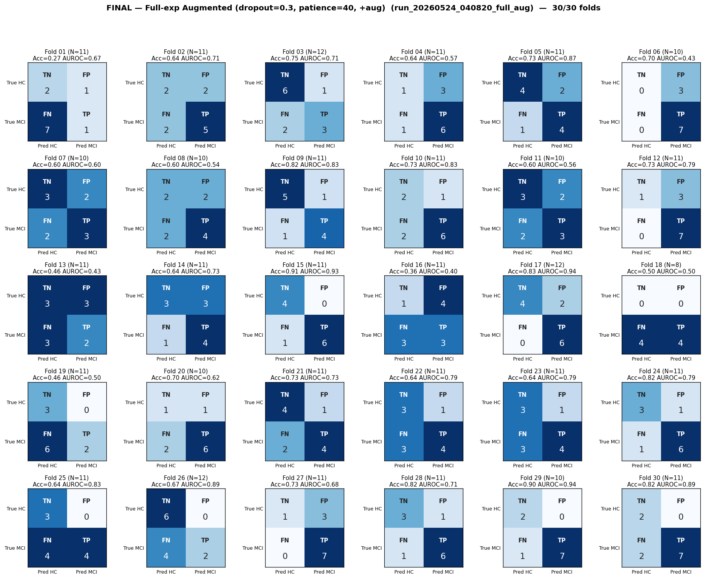

# Final Analysis — Full-exp Augmented (dropout=0.3, patience=40, +aug)
# Folds 01–30 of 30 (run complete)

> **Source:** `outputs/logs/run_20260524_040820_full_aug.log` (`full_experiments_using/run_20260524_040820_full_aug`).
> **Pipeline:** Full-experiments-using (8-task).
> **Training:** AdamW, warmup=5, grad-clip=1.0, ReduceLROnPlateau on val-AUROC, best-AUROC checkpoint per fold.
> **Status:** ✅ **30/30 folds complete.**

---

## Per-Fold Matrices

| Fold | N_eff | TN | FP | FN | TP | Acc | Sens | Spec | AUROC | Best val-AUROC | Best ep | Stopped @ |
|:----:|:-----:|:--:|:--:|:--:|:--:|:---:|:----:|:----:|:-----:|:--------------:|:-------:|:---------:|
| 01 | 11 | 2 | 1 | 7 | 1 | 0.273 | 0.125 | 0.667 | 0.667 | 0.6306 | 56 | 96 |
| 02 | 11 | 2 | 2 | 2 | 5 | 0.636 | 0.714 | 0.500 | 0.714 | 0.6060 | 15 | 55 |
| 03 | 12 | 6 | 1 | 2 | 3 | 0.750 | 0.600 | 0.857 | 0.714 | 0.6001 | 59 | 99 |
| 04 | 11 | 1 | 3 | 1 | 6 | 0.636 | 0.857 | 0.250 | 0.571 | 0.5760 | 38 | 78 |
| 05 | 11 | 4 | 2 | 1 | 4 | 0.727 | 0.800 | 0.667 | 0.867 | 0.6561 | 21 | 61 |
| 06 | 10 | 0 | 3 | 0 | 7 | 0.700 | 1.000 | 0.000 | 0.429 | 0.5698 | 26 | 66 |
| 07 | 10 | 3 | 2 | 2 | 3 | 0.600 | 0.600 | 0.600 | 0.600 | 0.6300 | 29 | 69 |
| 08 | 10 | 2 | 2 | 2 | 4 | 0.600 | 0.667 | 0.500 | 0.542 | 0.5810 | 15 | 55 |
| 09 | 11 | 5 | 1 | 1 | 4 | 0.818 | 0.800 | 0.833 | 0.833 | 0.6822 | 27 | 67 |
| 10 | 11 | 2 | 1 | 2 | 6 | 0.727 | 0.750 | 0.667 | 0.833 | 0.6582 | 50 | 90 |
| 11 | 10 | 3 | 2 | 2 | 3 | 0.600 | 0.600 | 0.600 | 0.560 | 0.5968 | 48 | 88 |
| 12 | 11 | 1 | 3 | 0 | 7 | 0.727 | 1.000 | 0.250 | 0.786 | 0.6051 | 19 | 59 |
| 13 | 11 | 3 | 3 | 3 | 2 | 0.455 | 0.400 | 0.500 | 0.433 | 0.5482 | 11 | 51 |
| 14 | 11 | 3 | 3 | 1 | 4 | 0.636 | 0.800 | 0.500 | 0.733 | 0.5789 | 14 | 54 |
| 15 | 11 | 4 | 0 | 1 | 6 | 0.909 | 0.857 | 1.000 | 0.929 | 0.6994 | 87 | 127 |
| 16 | 11 | 1 | 4 | 3 | 3 | 0.364 | 0.500 | 0.200 | 0.400 | 0.4821 | 6 | 46 |
| 17 | 12 | 4 | 2 | 0 | 6 | 0.833 | 1.000 | 0.667 | 0.944 | 0.6339 | 56 | 96 |
| 18 | 8 | 0 | 0 | 4 | 4 | 0.500 | 0.500 | 0.000 | 0.500 | 0.6339 | 90 | 130 |
| 19 | 11 | 3 | 0 | 6 | 2 | 0.455 | 0.250 | 1.000 | 0.500 | 0.5410 | 12 | 52 |
| 20 | 10 | 1 | 1 | 2 | 6 | 0.700 | 0.750 | 0.500 | 0.625 | 0.5926 | 18 | 58 |
| 21 | 11 | 4 | 1 | 2 | 4 | 0.727 | 0.667 | 0.800 | 0.733 | 0.5898 | 18 | 58 |
| 22 | 11 | 3 | 1 | 3 | 4 | 0.636 | 0.571 | 0.750 | 0.786 | 0.6192 | 67 | 107 |
| 23 | 11 | 3 | 1 | 3 | 4 | 0.636 | 0.571 | 0.750 | 0.786 | 0.6330 | 18 | 58 |
| 24 | 11 | 3 | 1 | 1 | 6 | 0.818 | 0.857 | 0.750 | 0.786 | 0.6756 | 39 | 79 |
| 25 | 11 | 3 | 0 | 4 | 4 | 0.636 | 0.500 | 1.000 | 0.833 | 0.6070 | 20 | 60 |
| 26 | 12 | 6 | 0 | 4 | 2 | 0.667 | 0.333 | 1.000 | 0.889 | 0.6362 | 85 | 125 |
| 27 | 11 | 1 | 3 | 0 | 7 | 0.727 | 1.000 | 0.250 | 0.679 | 0.6662 | 52 | 92 |
| 28 | 11 | 3 | 1 | 1 | 6 | 0.818 | 0.857 | 0.750 | 0.714 | 0.5981 | 38 | 78 |
| 29 | 10 | 2 | 0 | 1 | 7 | 0.900 | 0.875 | 1.000 | 0.938 | 0.7079 | 97 | 137 |
| 30 | 11 | 2 | 0 | 2 | 7 | 0.818 | 0.778 | 1.000 | 0.889 | 0.7500 | 59 | 99 |

---

## Aggregate Confusion (N = 324)

|              | Pred: HC | Pred: MCI |   |
|--------------|:--------:|:---------:|:-:|
| **True HC**  | TN = 80 | FP = 44 | 124 |
| **True MCI** | FN = 63 | TP = 137 | 200 |
|              | 143 | 181 | **324** |

| Pooled metric | Value |
|---|---|
| Accuracy    | **0.670** |
| Sensitivity | **0.685** |
| Specificity | **0.645** |
| Precision (PPV) | **0.757** |
| NPV | **0.559** |

---

## Macro Mean ± Std (30 folds)

| Metric | Mean | Std |
|--------|:----:|:---:|
| Accuracy    | 0.668 | 0.146 |
| Sensitivity | 0.686 | 0.221 |
| Specificity | 0.649 | 0.269 |
| AUROC       | 0.707 | 0.158 |

_Probe (task-contribution) report: see `task_contribution_probe.md` (in this folder)._