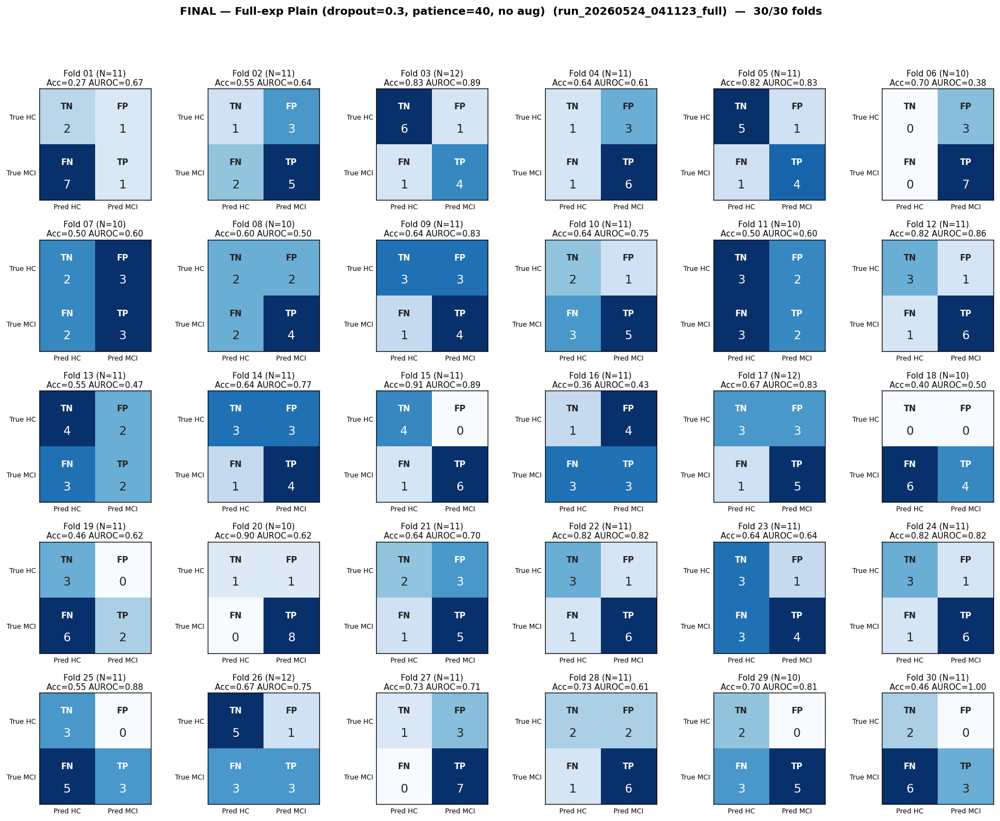

# Final Analysis — Full-exp Plain (dropout=0.3, patience=40, no aug)
# Folds 01–30 of 30 (run complete)

> **Source:** `outputs/logs/run_20260524_041123_full.log` (`full_experiments_using/run_20260524_041123_full`).
> **Pipeline:** Full-experiments-using (8-task).
> **Training:** AdamW, warmup=5, grad-clip=1.0, ReduceLROnPlateau on val-AUROC, best-AUROC checkpoint per fold.
> **Status:** ✅ **30/30 folds complete.**

---

## Per-Fold Matrices

| Fold | N_eff | TN | FP | FN | TP | Acc | Sens | Spec | AUROC | Best val-AUROC | Best ep | Stopped @ |
|:----:|:-----:|:--:|:--:|:--:|:--:|:---:|:----:|:----:|:-----:|:--------------:|:-------:|:---------:|
| 01 | 11 | 2 | 1 | 7 | 1 | 0.273 | 0.125 | 0.667 | 0.667 | 0.6350 | 29 | 69 |
| 02 | 11 | 1 | 3 | 2 | 5 | 0.545 | 0.714 | 0.250 | 0.643 | 0.6155 | 127 | 167 |
| 03 | 12 | 6 | 1 | 1 | 4 | 0.833 | 0.800 | 0.857 | 0.886 | 0.6307 | 86 | 126 |
| 04 | 11 | 1 | 3 | 1 | 6 | 0.636 | 0.857 | 0.250 | 0.607 | 0.5966 | 11 | 51 |
| 05 | 11 | 5 | 1 | 1 | 4 | 0.818 | 0.800 | 0.833 | 0.833 | 0.6805 | 54 | 94 |
| 06 | 10 | 0 | 3 | 0 | 7 | 0.700 | 1.000 | 0.000 | 0.381 | 0.5200 | 3 | 43 |
| 07 | 10 | 2 | 3 | 2 | 3 | 0.500 | 0.600 | 0.400 | 0.600 | 0.6122 | 20 | 60 |
| 08 | 10 | 2 | 2 | 2 | 4 | 0.600 | 0.667 | 0.500 | 0.500 | 0.5617 | 1 | 41 |
| 09 | 11 | 3 | 3 | 1 | 4 | 0.636 | 0.800 | 0.500 | 0.833 | 0.6742 | 31 | 71 |
| 10 | 11 | 2 | 1 | 3 | 5 | 0.636 | 0.625 | 0.667 | 0.750 | 0.6483 | 42 | 82 |
| 11 | 10 | 3 | 2 | 3 | 2 | 0.500 | 0.400 | 0.600 | 0.600 | 0.5909 | 18 | 58 |
| 12 | 11 | 3 | 1 | 1 | 6 | 0.818 | 0.857 | 0.750 | 0.857 | 0.6677 | 42 | 82 |
| 13 | 11 | 4 | 2 | 3 | 2 | 0.545 | 0.400 | 0.667 | 0.467 | 0.5309 | 20 | 60 |
| 14 | 11 | 3 | 3 | 1 | 4 | 0.636 | 0.800 | 0.500 | 0.767 | 0.6047 | 25 | 65 |
| 15 | 11 | 4 | 0 | 1 | 6 | 0.909 | 0.857 | 1.000 | 0.893 | 0.6771 | 35 | 75 |
| 16 | 11 | 1 | 4 | 3 | 3 | 0.364 | 0.500 | 0.200 | 0.433 | 0.4855 | 8 | 48 |
| 17 | 12 | 3 | 3 | 1 | 5 | 0.667 | 0.833 | 0.500 | 0.833 | 0.6249 | 29 | 69 |
| 18 | 10 | 0 | 0 | 6 | 4 | 0.400 | 0.400 | 0.000 | 0.500 | 0.6042 | 17 | 57 |
| 19 | 11 | 3 | 0 | 6 | 2 | 0.455 | 0.250 | 1.000 | 0.625 | 0.5994 | 5 | 45 |
| 20 | 10 | 1 | 1 | 0 | 8 | 0.900 | 1.000 | 0.500 | 0.625 | 0.5931 | 5 | 45 |
| 21 | 11 | 2 | 3 | 1 | 5 | 0.636 | 0.833 | 0.400 | 0.700 | 0.5433 | 1 | 41 |
| 22 | 11 | 3 | 1 | 1 | 6 | 0.818 | 0.857 | 0.750 | 0.821 | 0.6017 | 31 | 71 |
| 23 | 11 | 3 | 1 | 3 | 4 | 0.636 | 0.571 | 0.750 | 0.643 | 0.6428 | 17 | 57 |
| 24 | 11 | 3 | 1 | 1 | 6 | 0.818 | 0.857 | 0.750 | 0.821 | 0.6324 | 25 | 65 |
| 25 | 11 | 3 | 0 | 5 | 3 | 0.545 | 0.375 | 1.000 | 0.875 | 0.6344 | 13 | 53 |
| 26 | 12 | 5 | 1 | 3 | 3 | 0.667 | 0.500 | 0.833 | 0.750 | 0.6142 | 31 | 71 |
| 27 | 11 | 1 | 3 | 0 | 7 | 0.727 | 1.000 | 0.250 | 0.714 | 0.6598 | 30 | 70 |
| 28 | 11 | 2 | 2 | 1 | 6 | 0.727 | 0.857 | 0.500 | 0.607 | 0.6180 | 26 | 66 |
| 29 | 10 | 2 | 0 | 3 | 5 | 0.700 | 0.625 | 1.000 | 0.812 | 0.5793 | 41 | 81 |
| 30 | 11 | 2 | 0 | 6 | 3 | 0.455 | 0.333 | 1.000 | 1.000 | 0.6987 | 101 | 141 |

---

## Aggregate Confusion (N = 326)

|              | Pred: HC | Pred: MCI |   |
|--------------|:--------:|:---------:|:-:|
| **True HC**  | TN = 75 | FP = 49 | 124 |
| **True MCI** | FN = 69 | TP = 133 | 202 |
|              | 144 | 182 | **326** |

| Pooled metric | Value |
|---|---|
| Accuracy    | **0.638** |
| Sensitivity | **0.658** |
| Specificity | **0.605** |
| Precision (PPV) | **0.731** |
| NPV | **0.521** |

---

## Macro Mean ± Std (30 folds)

| Metric | Mean | Std |
|--------|:----:|:---:|
| Accuracy    | 0.637 | 0.156 |
| Sensitivity | 0.670 | 0.233 |
| Specificity | 0.616 | 0.269 |
| AUROC       | 0.701 | 0.151 |

_Probe (task-contribution) report: see `task_contribution_probe.md` (in this folder)._