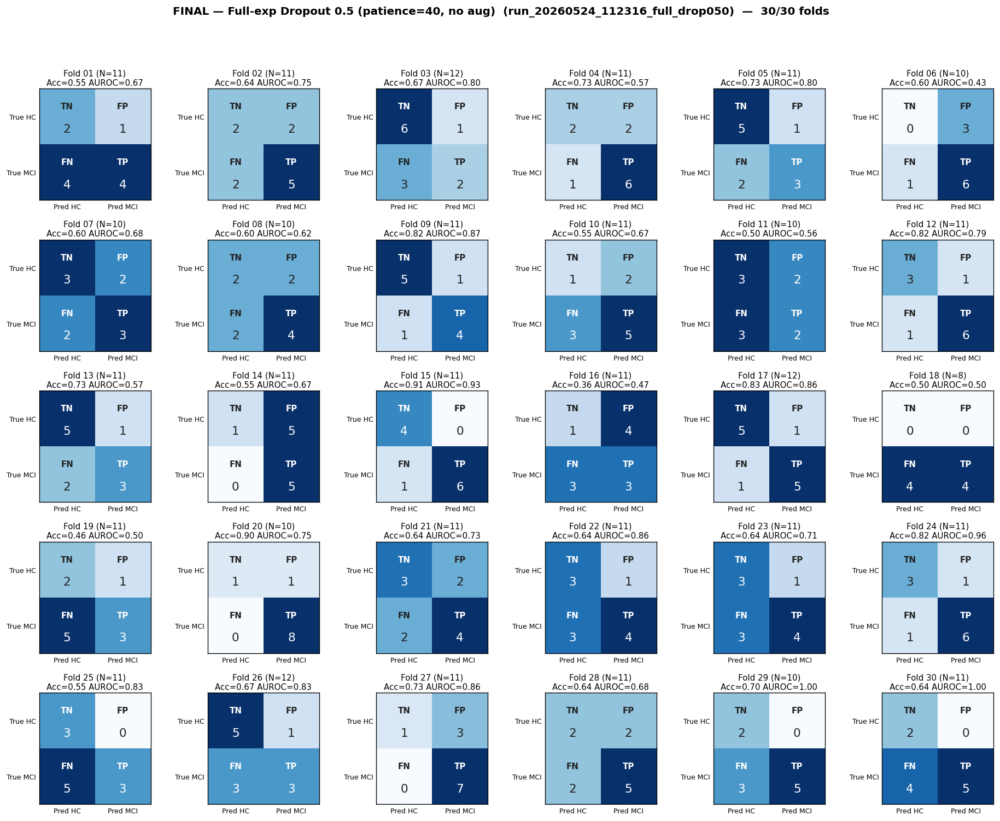

# Final Analysis — Full-exp Dropout 0.5 (patience=40, no aug)
# Folds 01–30 of 30 (run complete)

> **Source:** `outputs/logs/run_20260524_112316_full_drop050.log` (`full_experiments_using/run_20260524_112316_full_drop050`).
> **Pipeline:** Full-experiments-using (8-task).
> **Training:** AdamW, warmup=5, grad-clip=1.0, ReduceLROnPlateau on val-AUROC, best-AUROC checkpoint per fold.
> **Status:** ✅ **30/30 folds complete.**

---

## Per-Fold Matrices

| Fold | N_eff | TN | FP | FN | TP | Acc | Sens | Spec | AUROC | Best val-AUROC | Best ep | Stopped @ |
|:----:|:-----:|:--:|:--:|:--:|:--:|:---:|:----:|:----:|:-----:|:--------------:|:-------:|:---------:|
| 01 | 11 | 2 | 1 | 4 | 4 | 0.545 | 0.500 | 0.667 | 0.667 | 0.6607 | 46 | 86 |
| 02 | 11 | 2 | 2 | 2 | 5 | 0.636 | 0.714 | 0.500 | 0.750 | 0.6556 | 100 | 140 |
| 03 | 12 | 6 | 1 | 3 | 2 | 0.667 | 0.400 | 0.857 | 0.800 | 0.6008 | 39 | 79 |
| 04 | 11 | 2 | 2 | 1 | 6 | 0.727 | 0.857 | 0.500 | 0.571 | 0.5754 | 10 | 50 |
| 05 | 11 | 5 | 1 | 2 | 3 | 0.727 | 0.600 | 0.833 | 0.800 | 0.6653 | 23 | 63 |
| 06 | 10 | 0 | 3 | 1 | 6 | 0.600 | 0.857 | 0.000 | 0.429 | 0.5352 | 1 | 41 |
| 07 | 10 | 3 | 2 | 2 | 3 | 0.600 | 0.600 | 0.600 | 0.680 | 0.6162 | 61 | 101 |
| 08 | 10 | 2 | 2 | 2 | 4 | 0.600 | 0.667 | 0.500 | 0.625 | 0.5880 | 12 | 52 |
| 09 | 11 | 5 | 1 | 1 | 4 | 0.818 | 0.800 | 0.833 | 0.867 | 0.6657 | 22 | 62 |
| 10 | 11 | 1 | 2 | 3 | 5 | 0.545 | 0.625 | 0.333 | 0.667 | 0.6033 | 75 | 115 |
| 11 | 10 | 3 | 2 | 3 | 2 | 0.500 | 0.400 | 0.600 | 0.560 | 0.6155 | 30 | 70 |
| 12 | 11 | 3 | 1 | 1 | 6 | 0.818 | 0.857 | 0.750 | 0.786 | 0.6618 | 25 | 65 |
| 13 | 11 | 5 | 1 | 2 | 3 | 0.727 | 0.600 | 0.833 | 0.567 | 0.5860 | 25 | 65 |
| 14 | 11 | 1 | 5 | 0 | 5 | 0.545 | 1.000 | 0.167 | 0.667 | 0.6112 | 10 | 50 |
| 15 | 11 | 4 | 0 | 1 | 6 | 0.909 | 0.857 | 1.000 | 0.929 | 0.7002 | 48 | 88 |
| 16 | 11 | 1 | 4 | 3 | 3 | 0.364 | 0.500 | 0.200 | 0.467 | 0.5687 | 5 | 45 |
| 17 | 12 | 5 | 1 | 1 | 5 | 0.833 | 0.833 | 0.833 | 0.861 | 0.6135 | 47 | 87 |
| 18 | 8 | 0 | 0 | 4 | 4 | 0.500 | 0.500 | 0.000 | 0.500 | 0.6319 | 19 | 59 |
| 19 | 11 | 2 | 1 | 5 | 3 | 0.455 | 0.375 | 0.667 | 0.500 | 0.5576 | 8 | 48 |
| 20 | 10 | 1 | 1 | 0 | 8 | 0.900 | 1.000 | 0.500 | 0.750 | 0.6064 | 23 | 63 |
| 21 | 11 | 3 | 2 | 2 | 4 | 0.636 | 0.667 | 0.600 | 0.733 | 0.5988 | 44 | 84 |
| 22 | 11 | 3 | 1 | 3 | 4 | 0.636 | 0.571 | 0.750 | 0.857 | 0.6175 | 31 | 71 |
| 23 | 11 | 3 | 1 | 3 | 4 | 0.636 | 0.571 | 0.750 | 0.714 | 0.6211 | 23 | 63 |
| 24 | 11 | 3 | 1 | 1 | 6 | 0.818 | 0.857 | 0.750 | 0.964 | 0.6358 | 19 | 59 |
| 25 | 11 | 3 | 0 | 5 | 3 | 0.545 | 0.375 | 1.000 | 0.833 | 0.6163 | 16 | 56 |
| 26 | 12 | 5 | 1 | 3 | 3 | 0.667 | 0.500 | 0.833 | 0.833 | 0.6435 | 16 | 56 |
| 27 | 11 | 1 | 3 | 0 | 7 | 0.727 | 1.000 | 0.250 | 0.857 | 0.6581 | 40 | 80 |
| 28 | 11 | 2 | 2 | 2 | 5 | 0.636 | 0.714 | 0.500 | 0.679 | 0.6158 | 43 | 83 |
| 29 | 10 | 2 | 0 | 3 | 5 | 0.700 | 0.625 | 1.000 | 1.000 | 0.6704 | 54 | 94 |
| 30 | 11 | 2 | 0 | 4 | 5 | 0.636 | 0.556 | 1.000 | 1.000 | 0.6735 | 35 | 75 |

---

## Aggregate Confusion (N = 324)

|              | Pred: HC | Pred: MCI |   |
|--------------|:--------:|:---------:|:-:|
| **True HC**  | TN = 80 | FP = 44 | 124 |
| **True MCI** | FN = 67 | TP = 133 | 200 |
|              | 147 | 177 | **324** |

| Pooled metric | Value |
|---|---|
| Accuracy    | **0.657** |
| Sensitivity | **0.665** |
| Specificity | **0.645** |
| Precision (PPV) | **0.751** |
| NPV | **0.544** |

---

## Macro Mean ± Std (30 folds)

| Metric | Mean | Std |
|--------|:----:|:---:|
| Accuracy    | 0.655 | 0.128 |
| Sensitivity | 0.666 | 0.186 |
| Specificity | 0.642 | 0.261 |
| AUROC       | 0.730 | 0.155 |

_Probe (task-contribution) report: see `task_contribution_probe.md` (in this folder)._