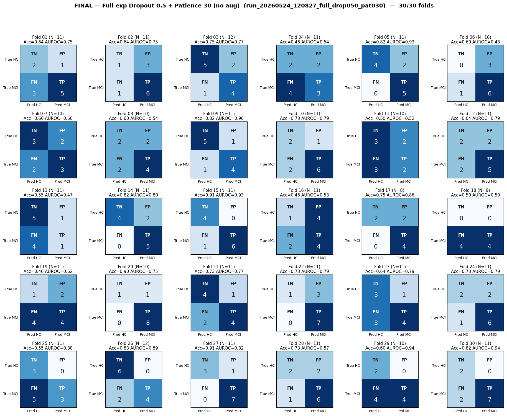

# Final Analysis — Full-exp Dropout 0.5 + Patience 30 (no aug)
# Folds 01–30 of 30 (run complete)

> **Source:** `outputs/logs/run_20260524_120827_full_drop050_pat030.log` (`full_experiments_using/run_20260524_120827_full_drop050_pat030`).
> **Pipeline:** Full-experiments-using (8-task).
> **Training:** AdamW, warmup=5, grad-clip=1.0, ReduceLROnPlateau on val-AUROC, best-AUROC checkpoint per fold.
> **Status:** ✅ **30/30 folds complete.**

---

## Per-Fold Matrices

| Fold | N_eff | TN | FP | FN | TP | Acc | Sens | Spec | AUROC | Best val-AUROC | Best ep | Stopped @ |
|:----:|:-----:|:--:|:--:|:--:|:--:|:---:|:----:|:----:|:-----:|:--------------:|:-------:|:---------:|
| 01 | 11 | 2 | 1 | 3 | 5 | 0.636 | 0.625 | 0.667 | 0.750 | 0.6622 | 126 | 156 |
| 02 | 11 | 1 | 3 | 1 | 6 | 0.636 | 0.857 | 0.250 | 0.750 | 0.6614 | 81 | 111 |
| 03 | 12 | 5 | 2 | 1 | 4 | 0.750 | 0.800 | 0.714 | 0.771 | 0.6425 | 44 | 74 |
| 04 | 11 | 2 | 2 | 4 | 3 | 0.455 | 0.429 | 0.500 | 0.536 | 0.5459 | 27 | 57 |
| 05 | 11 | 4 | 2 | 0 | 5 | 0.818 | 1.000 | 0.667 | 0.933 | 0.6531 | 55 | 108 |
| 06 | 10 | 0 | 3 | 1 | 6 | 0.600 | 0.857 | 0.000 | 0.429 | 0.5316 | 11 | 41 |
| 07 | 10 | 3 | 2 | 2 | 3 | 0.600 | 0.600 | 0.600 | 0.600 | 0.5937 | 68 | 98 |
| 08 | 10 | 2 | 2 | 2 | 4 | 0.600 | 0.667 | 0.500 | 0.542 | 0.5643 | 8 | 38 |
| 09 | 11 | 5 | 1 | 1 | 4 | 0.818 | 0.800 | 0.833 | 0.900 | 0.6665 | 54 | 84 |
| 10 | 11 | 2 | 1 | 2 | 6 | 0.727 | 0.750 | 0.667 | 0.792 | 0.6688 | 39 | 69 |
| 11 | 10 | 3 | 2 | 3 | 2 | 0.500 | 0.400 | 0.600 | 0.520 | 0.5971 | 17 | 47 |
| 12 | 11 | 2 | 2 | 2 | 5 | 0.636 | 0.714 | 0.500 | 0.786 | 0.6592 | 18 | 48 |
| 13 | 11 | 5 | 1 | 4 | 1 | 0.545 | 0.200 | 0.833 | 0.467 | 0.5252 | 6 | 36 |
| 14 | 11 | 4 | 2 | 0 | 5 | 0.818 | 1.000 | 0.667 | 0.800 | 0.6020 | 8 | 38 |
| 15 | 11 | 4 | 0 | 1 | 6 | 0.909 | 0.857 | 1.000 | 0.929 | 0.7066 | 102 | 132 |
| 16 | 11 | 1 | 4 | 2 | 4 | 0.455 | 0.667 | 0.200 | 0.533 | 0.5091 | 5 | 35 |
| 17 | 8 | 2 | 2 | 0 | 4 | 0.750 | 1.000 | 0.500 | 0.861 | 0.6305 | 58 | 88 |
| 18 | 8 | 0 | 0 | 4 | 4 | 0.500 | 0.500 | 0.000 | 0.500 | 0.5930 | 24 | 54 |
| 19 | 11 | 1 | 2 | 4 | 4 | 0.455 | 0.500 | 0.333 | 0.625 | 0.5919 | 35 | 65 |
| 20 | 10 | 1 | 1 | 0 | 8 | 0.900 | 1.000 | 0.500 | 0.750 | 0.6082 | 102 | 132 |
| 21 | 11 | 4 | 1 | 2 | 4 | 0.727 | 0.667 | 0.800 | 0.767 | 0.6361 | 9 | 39 |
| 22 | 11 | 1 | 3 | 0 | 7 | 0.727 | 1.000 | 0.250 | 0.786 | 0.5958 | 40 | 70 |
| 23 | 11 | 3 | 1 | 3 | 4 | 0.636 | 0.571 | 0.750 | 0.786 | 0.6217 | 79 | 128 |
| 24 | 11 | 2 | 2 | 1 | 6 | 0.727 | 0.857 | 0.500 | 0.786 | 0.6282 | 39 | 69 |
| 25 | 11 | 3 | 0 | 5 | 3 | 0.545 | 0.375 | 1.000 | 0.875 | 0.6379 | 21 | 51 |
| 26 | 12 | 6 | 0 | 2 | 4 | 0.833 | 0.667 | 1.000 | 0.889 | 0.6461 | 83 | 113 |
| 27 | 11 | 3 | 1 | 0 | 7 | 0.909 | 1.000 | 0.750 | 0.821 | 0.6750 | 40 | 70 |
| 28 | 11 | 2 | 2 | 1 | 6 | 0.727 | 0.857 | 0.500 | 0.571 | 0.5688 | 24 | 54 |
| 29 | 10 | 2 | 0 | 4 | 4 | 0.600 | 0.500 | 1.000 | 0.938 | 0.6791 | 37 | 67 |
| 30 | 11 | 2 | 0 | 2 | 7 | 0.818 | 0.778 | 1.000 | 0.944 | 0.7240 | 44 | 74 |

---

## Aggregate Confusion (N = 320)

|              | Pred: HC | Pred: MCI |   |
|--------------|:--------:|:---------:|:-:|
| **True HC**  | TN = 77 | FP = 45 | 122 |
| **True MCI** | FN = 57 | TP = 141 | 198 |
|              | 134 | 186 | **320** |

| Pooled metric | Value |
|---|---|
| Accuracy    | **0.681** |
| Sensitivity | **0.712** |
| Specificity | **0.631** |
| Precision (PPV) | **0.758** |
| NPV | **0.575** |

---

## Macro Mean ± Std (30 folds)

| Metric | Mean | Std |
|--------|:----:|:---:|
| Accuracy    | 0.679 | 0.137 |
| Sensitivity | 0.716 | 0.213 |
| Specificity | 0.623 | 0.257 |
| AUROC       | 0.731 | 0.155 |

_Probe (task-contribution) report: see `task_contribution_probe.md` (in this folder)._