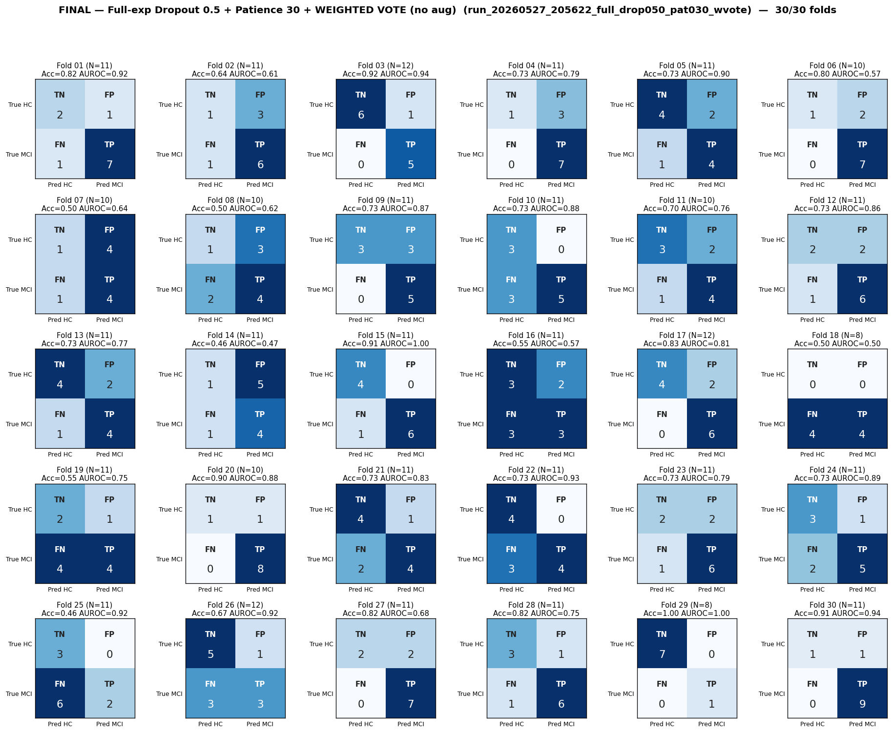

# Final Analysis — Full-exp Dropout 0.5 + Patience 30 + WEIGHTED VOTE (no aug)
# Folds 01–30 of 30 (run complete)

> **Source:** `outputs/logs/run_20260527_205622_full_drop050_pat030_wvote.log` (`full_experiments_using/run_20260527_205622_full_drop050_pat030_wvote`).
> **Pipeline:** Full-experiments-using (8-task).
> **Training:** AdamW, warmup=5, grad-clip=1.0, ReduceLROnPlateau on val-AUROC, best-AUROC checkpoint per fold.
> **System architecture:** [`WVOTE_SYSTEM_ARCHITECTURE.md`](../../../../WVOTE_SYSTEM_ARCHITECTURE.md) (project root) — component-by-component reference (CWT pipeline → MobileViT model → wvote aggregation → probe).
> **Status:** ✅ **30/30 folds complete.**

---

## Per-Fold Matrices

| Fold | N_eff | TN | FP | FN | TP | Acc | Sens | Spec | AUROC | Best val-AUROC | Best ep | Stopped @ |
|:----:|:-----:|:--:|:--:|:--:|:--:|:---:|:----:|:----:|:-----:|:--------------:|:-------:|:---------:|
| 01 | 11 | 2 | 1 | 1 | 7 | 0.818 | 0.875 | 0.667 | 0.917 | 0.6412 | 82 | 112 |
| 02 | 11 | 1 | 3 | 1 | 6 | 0.636 | 0.857 | 0.250 | 0.607 | 0.6091 | 90 | 120 |
| 03 | 12 | 6 | 1 | 0 | 5 | 0.917 | 1.000 | 0.857 | 0.943 | 0.6042 | 20 | 50 |
| 04 | 11 | 1 | 3 | 0 | 7 | 0.727 | 1.000 | 0.250 | 0.786 | 0.5588 | 39 | 69 |
| 05 | 11 | 4 | 2 | 1 | 4 | 0.727 | 0.800 | 0.667 | 0.900 | 0.6745 | 42 | 72 |
| 06 | 10 | 1 | 2 | 0 | 7 | 0.800 | 1.000 | 0.333 | 0.571 | 0.5560 | 14 | 44 |
| 07 | 10 | 1 | 4 | 1 | 4 | 0.500 | 0.800 | 0.200 | 0.640 | 0.5991 | 9 | 39 |
| 08 | 10 | 1 | 3 | 2 | 4 | 0.500 | 0.667 | 0.250 | 0.625 | 0.5461 | 23 | 53 |
| 09 | 11 | 3 | 3 | 0 | 5 | 0.727 | 1.000 | 0.500 | 0.867 | 0.6864 | 88 | 118 |
| 10 | 11 | 3 | 0 | 3 | 5 | 0.727 | 0.625 | 1.000 | 0.875 | 0.6493 | 79 | 109 |
| 11 | 10 | 3 | 2 | 1 | 4 | 0.700 | 0.800 | 0.600 | 0.760 | 0.6114 | 37 | 67 |
| 12 | 11 | 2 | 2 | 1 | 6 | 0.727 | 0.857 | 0.500 | 0.857 | 0.6345 | 19 | 49 |
| 13 | 11 | 4 | 2 | 1 | 4 | 0.727 | 0.800 | 0.667 | 0.767 | 0.5740 | 7 | 37 |
| 14 | 11 | 1 | 5 | 1 | 4 | 0.455 | 0.800 | 0.167 | 0.467 | 0.6218 | 52 | 82 |
| 15 | 11 | 4 | 0 | 1 | 6 | 0.909 | 0.857 | 1.000 | 1.000 | 0.6334 | 28 | 58 |
| 16 | 11 | 3 | 2 | 3 | 3 | 0.545 | 0.500 | 0.600 | 0.567 | 0.4811 | 3 | 33 |
| 17 | 12 | 4 | 2 | 0 | 6 | 0.833 | 1.000 | 0.667 | 0.806 | 0.6065 | 37 | 67 |
| 18 | 8 | 0 | 0 | 4 | 4 | 0.500 | 0.500 | 0.000 | 0.500 | 0.6683 | 8 | 38 |
| 19 | 11 | 2 | 1 | 4 | 4 | 0.545 | 0.500 | 0.667 | 0.750 | 0.5840 | 12 | 42 |
| 20 | 10 | 1 | 1 | 0 | 8 | 0.900 | 1.000 | 0.500 | 0.875 | 0.6040 | 17 | 47 |
| 21 | 11 | 4 | 1 | 2 | 4 | 0.727 | 0.667 | 0.800 | 0.833 | 0.6416 | 9 | 39 |
| 22 | 11 | 4 | 0 | 3 | 4 | 0.727 | 0.571 | 1.000 | 0.929 | 0.5937 | 16 | 46 |
| 23 | 11 | 2 | 2 | 1 | 6 | 0.727 | 0.857 | 0.500 | 0.786 | 0.6504 | 56 | 86 |
| 24 | 11 | 3 | 1 | 2 | 5 | 0.727 | 0.714 | 0.750 | 0.893 | 0.6666 | 63 | 93 |
| 25 | 11 | 3 | 0 | 6 | 2 | 0.455 | 0.250 | 1.000 | 0.917 | 0.5572 | 34 | 64 |
| 26 | 12 | 5 | 1 | 3 | 3 | 0.667 | 0.500 | 0.833 | 0.917 | 0.6203 | 15 | 45 |
| 27 | 11 | 2 | 2 | 0 | 7 | 0.818 | 1.000 | 0.500 | 0.679 | 0.6662 | 28 | 58 |
| 28 | 11 | 3 | 1 | 1 | 6 | 0.818 | 0.857 | 0.750 | 0.750 | 0.6304 | 31 | 61 |
| 29 | 8 | 7 | 0 | 0 | 1 | 1.000 | 1.000 | 1.000 | 1.000 | 0.7376 | 38 | 68 |
| 30 | 11 | 1 | 1 | 0 | 9 | 0.909 | 1.000 | 0.500 | 0.944 | 0.6368 | 62 | 92 |

---

## Aggregate Confusion (N = 322)

|              | Pred: HC | Pred: MCI |   |
|--------------|:--------:|:---------:|:-:|
| **True HC**  | TN = 81 | FP = 48 | 129 |
| **True MCI** | FN = 43 | TP = 150 | 193 |
|              | 124 | 198 | **322** |

| Pooled metric | Value |
|---|---|
| Accuracy    | **0.717** |
| Sensitivity | **0.777** |
| Specificity | **0.628** |
| Precision (PPV) | **0.758** |
| NPV | **0.653** |

---

## Macro Mean ± Std (30 folds)

| Metric | Mean | Std |
|--------|:----:|:---:|
| Accuracy    | 0.717 | 0.144 |
| Sensitivity | 0.788 | 0.197 |
| Specificity | 0.620 | 0.253 |
| AUROC       | 0.791 | 0.146 |

_Probe (task-contribution) report: see `task_contribution_probe.md` (in this folder)._