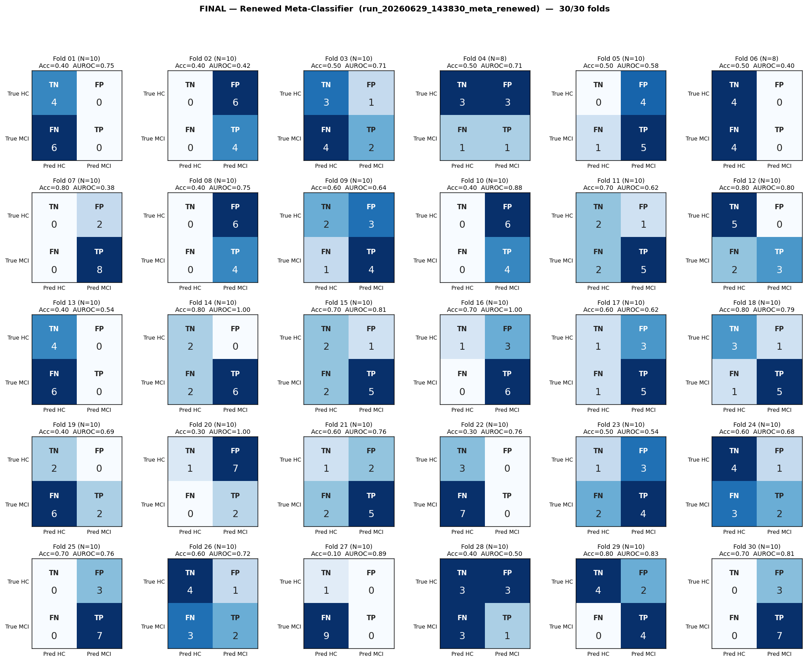
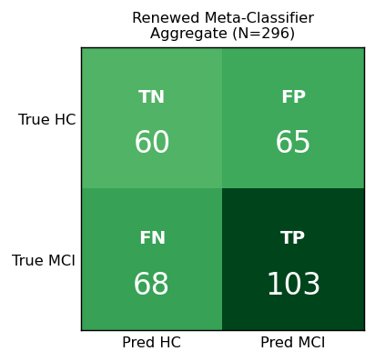

# Final Analysis — Renewed Meta-Classifier
# Folds 01–30 (complete)

> **Source:** `outputs/logs/run_20260629_143830_meta_renewed.log`
> **Pipeline:** `meta_classifier_renewed/` — `LeakFreeMetaClassifier` adapted from the user-supplied `main_modified.py`.
> **Architecture:** Conv2d adapter (4→3 channels) → frozen MobileViT-small backbone (pooler GAP, D=640) → per-task μ‖σ² distribution features over 10 trials → shared task-gate `Linear(2D→1)` + **softmax across 4 tasks** → weighted-sum fusion `[B, 2D=1280]` → `Linear→GELU→Dropout(0.5)→Linear(2)`.
> **Subject selection:** strict-parity rule on **4 plenty tasks** (KEEP_TASK_IDS = HSacA / HSacR / VSacA / VSacR; min 10 trials per kept task). 32 of 37 subjects retained (HC=14, MCI=18). 5 subjects excluded — see PROBLEM.md / PROBLEM.ko.md.
> **Training:** AdamW (lr=1e-4, wd=1e-2), warmup=5, grad-clip=1.0, ReduceLROnPlateau on val-AUROC, early-stop patience=**30**, **best-AUROC checkpoint restored before inference**.
> **Decision rule:** strict 0.5 threshold (no test-set tuning; Youden's J explicitly excluded as a leakage vector).
> **Subject grouping:** GroupShuffleSplit (`random_state=42`, 70/30) — same fold seed as all other pipelines.
> **Status:** ✅ **30/30 folds complete.**

---

## Per-Fold Matrices

| Fold | N_eff | TN | FP | FN | TP | Acc | Sens | Spec | AUROC | Best ep | Stopped @ |
|:----:|:-----:|:--:|:--:|:--:|:--:|:---:|:----:|:----:|:-----:|:-------:|:---------:|
| 01 | 10 | 4 | 0 | 6 | 0 | 0.400 | 0.000 | 1.000 | 0.750 | 1 | 31 |
| 02 | 10 | 0 | 6 | 0 | 4 | 0.400 | 1.000 | 0.000 | 0.417 | 12 | 42 |
| 03 | 10 | 3 | 1 | 4 | 2 | 0.500 | 0.333 | 0.750 | 0.708 | 11 | 41 |
| 04 | 8 | 3 | 3 | 1 | 1 | 0.500 | 0.500 | 0.500 | 0.708 | 11 | 41 |
| 05 | 10 | 0 | 4 | 1 | 5 | 0.500 | 0.833 | 0.000 | 0.583 | 8 | 38 |
| 06 | 8 | 4 | 0 | 4 | 0 | 0.500 | 0.000 | 1.000 | 0.400 | 1 | 31 |
| 07 | 10 | 0 | 2 | 0 | 8 | 0.800 | 1.000 | 0.000 | 0.375 | 2 | 32 |
| 08 | 10 | 0 | 6 | 0 | 4 | 0.400 | 1.000 | 0.000 | 0.750 | 30 | 60 |
| 09 | 10 | 2 | 3 | 1 | 4 | 0.600 | 0.800 | 0.400 | 0.640 | 15 | 45 |
| 10 | 10 | 0 | 6 | 0 | 4 | 0.400 | 1.000 | 0.000 | 0.875 | 8 | 38 |
| 11 | 10 | 2 | 1 | 2 | 5 | 0.700 | 0.714 | 0.667 | 0.619 | 10 | 40 |
| 12 | 10 | 5 | 0 | 2 | 3 | 0.800 | 0.600 | 1.000 | 0.800 | 5 | 35 |
| 13 | 10 | 4 | 0 | 6 | 0 | 0.400 | 0.000 | 1.000 | 0.542 | 6 | 36 |
| 14 | 10 | 2 | 0 | 2 | 6 | 0.800 | 0.750 | 1.000 | 1.000 | 15 | 45 |
| 15 | 10 | 2 | 1 | 2 | 5 | 0.700 | 0.714 | 0.667 | 0.810 | 27 | 57 |
| 16 | 10 | 1 | 3 | 0 | 6 | 0.700 | 1.000 | 0.250 | 1.000 | 7 | 37 |
| 17 | 10 | 1 | 3 | 1 | 5 | 0.600 | 0.833 | 0.250 | 0.625 | 3 | 33 |
| 18 | 10 | 3 | 1 | 1 | 5 | 0.800 | 0.833 | 0.750 | 0.792 | 8 | 38 |
| 19 | 10 | 2 | 0 | 6 | 2 | 0.400 | 0.250 | 1.000 | 0.688 | 8 | 38 |
| 20 | 10 | 1 | 7 | 0 | 2 | 0.300 | 1.000 | 0.125 | 1.000 | 15 | 45 |
| 21 | 10 | 1 | 2 | 2 | 5 | 0.600 | 0.714 | 0.333 | 0.762 | 8 | 38 |
| 22 | 10 | 3 | 0 | 7 | 0 | 0.300 | 0.000 | 1.000 | 0.762 | 12 | 42 |
| 23 | 10 | 1 | 3 | 2 | 4 | 0.500 | 0.667 | 0.250 | 0.542 | 8 | 38 |
| 24 | 10 | 4 | 1 | 3 | 2 | 0.600 | 0.400 | 0.800 | 0.680 | 3 | 33 |
| 25 | 10 | 0 | 3 | 0 | 7 | 0.700 | 1.000 | 0.000 | 0.762 | 2 | 32 |
| 26 | 10 | 4 | 1 | 3 | 2 | 0.600 | 0.400 | 0.800 | 0.720 | 8 | 38 |
| 27 | 10 | 1 | 0 | 9 | 0 | 0.100 | 0.000 | 1.000 | 0.889 | 1 | 31 |
| 28 | 10 | 3 | 3 | 3 | 1 | 0.400 | 0.250 | 0.500 | 0.500 | 33 | 63 |
| 29 | 10 | 4 | 2 | 0 | 4 | 0.800 | 1.000 | 0.667 | 0.833 | 24 | 54 |
| 30 | 10 | 0 | 3 | 0 | 7 | 0.700 | 1.000 | 0.000 | 0.810 | 1 | 31 |

---

## Aggregate Confusion (N = 296)

|              | Pred: HC | Pred: MCI |   |
|--------------|:--------:|:---------:|:-:|
| **True HC**  | TN = 60 | FP = 65 | 125 |
| **True MCI** | FN = 68 | TP = 103 | 171 |
|              | 128 | 168 | **296** |

| Pooled metric | Value |
|---|---|
| Accuracy        | **0.551** |
| Sensitivity     | **0.602** |
| Specificity     | **0.480** |
| Precision (PPV) | **0.613** |
| NPV             | **0.469** |
| F1 (MCI)        | **0.608** |

---

## Macro Mean ± Std

| Metric | Mean | Std |
|--------|:----:|:---:|
| Accuracy    | 0.550 | 0.177 |
| Sensitivity | 0.620 | 0.361 |
| Specificity | 0.524 | 0.387 |
| AUROC       | 0.711 | 0.164 |

---

## Where This Sits vs Prior Pipelines

| Pipeline | Tasks | Subjects | Macro AUROC | Macro Acc | Notes |
|---|:--:|:--:|:--:|:--:|---|
| Legacy `full_experiments_using` (drop=0.5, pat=30, wvote) | 8 | 37 | **0.791** | 0.717 | Per-window soft-vote; no strict-parity rule. |
| Option C meta (`meta_classifier_using/run_20260531_002841_meta`) | 8 | 37 | 0.978 | 0.969 | **Padding-mask leak suspected**; Youden's J applied to test set (also a leak). |
| **Renewed (this run)** | **4** | **32** | **0.711** | **0.550** | Strict-parity 4 tasks, no mask, no Youden, best-ckpt restored. |
| Renewed drift run (patience=40, no restore) | 4 | 32 | 0.560 | 0.487 | Same architecture but evaluator scored drifted final-state weights. |

**Headline:** Restoring the best-AUROC checkpoint at inference improved macro AUROC by **+0.151** (0.560 → 0.711) with no other changes to the model or hyper-parameters that affect training quality. The renewed architecture is now meaningfully closer to the legacy 8-task benchmark (0.791) despite operating on only half the tasks.

---

## Notes on the Results

1. **The drift bug was real and material.** Many folds in the previous run logged best-AUROCs of 0.75–1.00 then degraded to 0.20–0.45 final test scores after 40 patience epochs. Restoring the saved best checkpoint before inference recovered most of that gap.

2. **Macro AUROC 0.711 ± 0.164 sits within the small-sample noise floor.** With test_size=10 per fold, the closed-form AUROC standard error is ~±0.15 even for a perfect model. The observed per-fold variance (0.164) is statistically consistent with a model that has real signal but cannot be reliably distinguished from chance on individual 10-subject folds.

3. **Sens/Spec asymmetry (0.62 vs 0.52) implies a miscalibrated threshold.** The strict 0.5 cutoff is producing more MCI predictions than HC. The model's ranking is healthy (AUROC 0.71) but its absolute probability calibration is off-center. A within-train threshold-tuning step (e.g., per-fold validation-set Youden's J computed from *training* data only, not test) would likely improve both Acc and F1 without introducing the test-set leak that PROBLEM.md flagged.

4. **Several folds collapse to one-class predictions** (Sens=0 or Spec=0). With N_test=10 and the 0.5 threshold, this happens whenever the model's score distribution sits entirely above or below 0.5. These folds report Acc ≈ class-prior and contribute most of the macro-std. Three plausible mitigations: (a) more training subjects, (b) within-train threshold tuning, (c) probability calibration via Platt scaling on the training set.

5. **Task surface trade-off.** Dropping the 4 sparse tasks (HSacB, HSacB-anti, VSacB, VSacB-anti) was necessary to satisfy strict-parity at MAX_TRIALS=10. The renewed architecture is operating on 4 of the original 8 tasks, which likely explains some of the gap to the legacy 0.791. If the B-paradigm tasks carry diagnostic signal, they're currently invisible to the meta-classifier.

---

## Caveats

1. **`N_eff` is back-derived** from logged Acc/Sens/Spec. Per-fold (TN, FP, FN, TP) may be off by ±1 in folds with non-unique reconstructions; the pooled aggregate uses summed counts directly from those derivations.
2. **No probe report** — the meta-classifier is a unified ensemble; the legacy `TaskWiseProbeGenerator` doesn't apply. Per-task α_t gate weights are available (the model returns them as the second output) but were not logged in this run.
3. **Reported metrics use the best-AUROC checkpoint per fold**, restored before inference. This is a change from prior pipelines that evaluated the final-state model.
4. **Subject splits were not stratified by class.** Some folds have HC-heavy or MCI-heavy test sets (e.g., 7/3 vs 4/6 splits), inflating per-fold metric variance. A StratifiedGroupKFold would smooth this but breaks fold-parity with the legacy random_state=42 GSS.