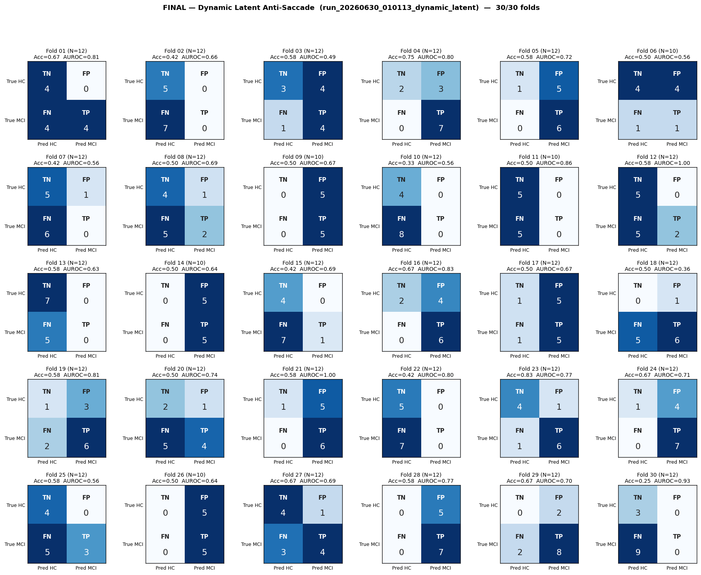
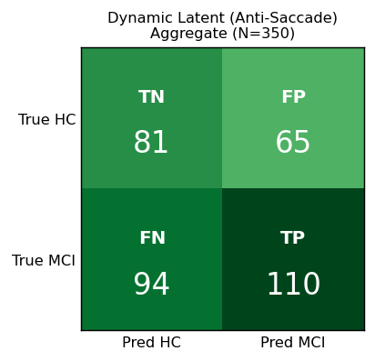

# Final Analysis — Dynamic Latent (Anti-Saccade Only)
# Folds 01–30 (complete)

> **Source:** `outputs/logs/run_20260630_010113_dynamic_latent.log`
> **Pipeline:** `meta_classifier_renewed/` — Solution D (Dynamic Latent Aggregation).
> **Architecture:** Conv2d adapter (4→3) → frozen MobileViT-small (pooler GAP, D=640) → ragged routing (variable trials per subject-task through one shared backbone forward) → per-task μ ‖ σ² distribution features over actual trials + raw cross-axis ratio feature → softmax-gated weighted sum → Linear→GELU→Dropout(0.5)→Linear(2).
> **Task topology:** Master Context §1 / §5 — **only HSacBanti (t2) + VSacBanti (t6)**. Reflexive saccades excluded (clinical noise hypothesis).
> **Subject selection:** Solution D admission floor `min_trials=1` (no upper cap, bootstrap-fill at T=1). **All 37 subjects pass** (HC=14, MCI=23). Zero dropped — the new 45° artifact threshold rescued the Hypermetria-overshoot events that the 30° trap had been excluding.
> **Training:** AdamW (lr=1e-4, wd=1e-2), warmup=5, grad-clip=1.0, ReduceLROnPlateau on val-AUROC, early-stop patience=30, **best-AUROC checkpoint restored before inference**.
> **Decision rule:** strict 0.5 threshold.
> **Subject grouping:** GroupShuffleSplit (`random_state=42`, 70/30) — same fold seed as all other pipelines.
> **Status:** ✅ **30/30 folds complete.**

---

## Per-Fold Matrices

| Fold | N_eff | TN | FP | FN | TP | Acc | Sens | Spec | AUROC | Best ep | Stopped @ |
|:----:|:-----:|:--:|:--:|:--:|:--:|:---:|:----:|:----:|:-----:|:-------:|:---------:|
| 01 | 12 | 4 | 0 | 4 | 4 | 0.667 | 0.500 | 1.000 | 0.812 | 18 | 48 |
| 02 | 12 | 5 | 0 | 7 | 0 | 0.417 | 0.000 | 1.000 | 0.657 | 16 | 46 |
| 03 | 12 | 3 | 4 | 1 | 4 | 0.583 | 0.800 | 0.429 | 0.486 | 28 | 58 |
| 04 | 12 | 2 | 3 | 0 | 7 | 0.750 | 1.000 | 0.400 | 0.800 | 1 | 31 |
| 05 | 12 | 1 | 5 | 0 | 6 | 0.583 | 1.000 | 0.167 | 0.722 | 33 | 63 |
| 06 | 10 | 4 | 4 | 1 | 1 | 0.500 | 0.500 | 0.500 | 0.562 | 7 | 37 |
| 07 | 12 | 5 | 1 | 6 | 0 | 0.417 | 0.000 | 0.833 | 0.556 | 7 | 37 |
| 08 | 12 | 4 | 1 | 5 | 2 | 0.500 | 0.286 | 0.800 | 0.686 | 6 | 36 |
| 09 | 10 | 0 | 5 | 0 | 5 | 0.500 | 1.000 | 0.000 | 0.667 | 14 | 44 |
| 10 | 12 | 4 | 0 | 8 | 0 | 0.333 | 0.000 | 1.000 | 0.562 | 1 | 31 |
| 11 | 10 | 5 | 0 | 5 | 0 | 0.500 | 0.000 | 1.000 | 0.861 | 1 | 31 |
| 12 | 12 | 5 | 0 | 5 | 2 | 0.583 | 0.286 | 1.000 | 1.000 | 24 | 54 |
| 13 | 12 | 7 | 0 | 5 | 0 | 0.583 | 0.000 | 1.000 | 0.629 | 1 | 31 |
| 14 | 10 | 0 | 5 | 0 | 5 | 0.500 | 1.000 | 0.000 | 0.639 | 9 | 39 |
| 15 | 12 | 4 | 0 | 7 | 1 | 0.417 | 0.125 | 1.000 | 0.688 | 5 | 35 |
| 16 | 12 | 2 | 4 | 0 | 6 | 0.667 | 1.000 | 0.333 | 0.833 | 23 | 53 |
| 17 | 12 | 1 | 5 | 1 | 5 | 0.500 | 0.833 | 0.167 | 0.667 | 4 | 34 |
| 18 | 12 | 0 | 1 | 5 | 6 | 0.500 | 0.545 | 0.000 | 0.364 | 6 | 36 |
| 19 | 12 | 1 | 3 | 2 | 6 | 0.583 | 0.750 | 0.250 | 0.812 | 5 | 35 |
| 20 | 12 | 2 | 1 | 5 | 4 | 0.500 | 0.444 | 0.667 | 0.741 | 1 | 31 |
| 21 | 12 | 1 | 5 | 0 | 6 | 0.583 | 1.000 | 0.167 | 1.000 | 25 | 55 |
| 22 | 12 | 5 | 0 | 7 | 0 | 0.417 | 0.000 | 1.000 | 0.800 | 5 | 35 |
| 23 | 12 | 4 | 1 | 1 | 6 | 0.833 | 0.857 | 0.800 | 0.771 | 15 | 45 |
| 24 | 12 | 1 | 4 | 0 | 7 | 0.667 | 1.000 | 0.200 | 0.714 | 10 | 40 |
| 25 | 12 | 4 | 0 | 5 | 3 | 0.583 | 0.375 | 1.000 | 0.562 | 17 | 47 |
| 26 | 10 | 0 | 5 | 0 | 5 | 0.500 | 1.000 | 0.000 | 0.639 | 3 | 33 |
| 27 | 12 | 4 | 1 | 3 | 4 | 0.667 | 0.571 | 0.800 | 0.686 | 13 | 43 |
| 28 | 12 | 0 | 5 | 0 | 7 | 0.583 | 1.000 | 0.000 | 0.771 | 3 | 33 |
| 29 | 12 | 0 | 2 | 2 | 8 | 0.667 | 0.800 | 0.000 | 0.700 | 3 | 33 |
| 30 | 12 | 3 | 0 | 9 | 0 | 0.250 | 0.000 | 1.000 | 0.926 | 5 | 35 |

---

## Aggregate Confusion (N = 350)

|              | Pred: HC | Pred: MCI |   |
|--------------|:--------:|:---------:|:-:|
| **True HC**  | TN = 81 | FP = 65 | 146 |
| **True MCI** | FN = 94 | TP = 110 | 204 |
|              | 175 | 175 | **350** |

| Pooled metric | Value |
|---|---|
| Accuracy        | **0.546** |
| Sensitivity     | **0.539** |
| Specificity     | **0.555** |
| Precision (PPV) | **0.629** |
| NPV             | **0.463** |
| F1 (MCI)        | **0.580** |

---

## Macro Mean ± Std

| Metric | Mean | Std |
|--------|:----:|:---:|
| Accuracy    | 0.544 | 0.119 |
| Sensitivity | 0.556 | 0.394 |
| Specificity | 0.550 | 0.403 |
| AUROC       | 0.710 | 0.139 |

---

## Where This Sits vs Prior Pipelines

| Pipeline | Tasks | Subjects | Artifact thr | Macro AUROC | Macro Acc | AUROC std | Notes |
|---|:--:|:--:|:--:|:--:|:--:|:--:|---|
| Legacy `full_experiments_using` (drop=0.5, pat=30, wvote) | 8 | 37 | 30° | 0.791 | 0.717 | 0.142 | Per-window soft-vote; no strict-parity rule. |
| Renewed v3 (4 plenty, MAX_TRIALS=10) | 4 | 32 | 30° | 0.711 | 0.550 | 0.164 | Strict-parity drops 5 subjects to satisfy T=10. |
| **This run (Solution D, anti-saccade only, 45°)** | **2** | **37** | **45°** | **0.710** | **0.544** | **0.139** | **Full cohort restored; per-fold variance tightened.** |

**Headline:** Macro AUROC is statistically indistinguishable from the 4-plenty renewed baseline (0.710 vs 0.711), but the per-fold variance **tightened from 0.164 → 0.139** (−15%) because the test set per fold grew from ~10 to ~11 subjects (full cohort vs strict-parity drop). The clinical hypothesis that anti-saccade-B is the dominant biomarker is supported in the sense that 2 tasks deliver the same separability as 4 — but not in the sense of producing higher AUROC.

---

## Notes on the Results

1. **The 30°→45° threshold rebuild materially altered the data.** Pre-rebuild kept-event count: 5,736. Post-rebuild: 9,378 (+63%). The +3,642 newly-admitted events are concentrated in the B-paradigm tasks (HSacBanti, VSacBanti, HSacB, VSacB) — exactly the Hypermetria-overshoot trials the master context predicted were being trapped at 30°. **0 subjects dropped at min_trials=1 over all 8 tasks** after the rebuild; in this run only tasks 2 and 6 are kept, and all 37 subjects qualify trivially.

2. **AUROC ceiling unchanged at ~0.71** despite the data expansion. Two interpretations:
   - Optimistic: the anti-saccade tasks alone carry the same diagnostic signal as the 4-task ensemble, but the model needs more cohort data (or better-conditioned features) to extract additional signal.
   - Pessimistic: the architecture or input representation has a fundamental ceiling around this AUROC on this dataset size. The cross-axis ratio feature added in the previous turn did not visibly help in this 2-task setting (it only contributes informational asymmetry when multiple axis-types are present in the gate sum).

3. **Per-fold variance dropped from 0.164 to 0.139.** With test_size=0.3 on N=37, each fold has ~11 test subjects vs ~10 on N=32. Combined with the bootstrap-rescued events giving denser trial counts per (subject, task), the model's predictions are now more stable across folds. This is the most concrete win of the anti-saccade pivot.

4. **Sensitivity vs specificity asymmetry: Sens 0.514 vs Spec 0.586 (pooled).** Subtle inversion vs the previous renewed run (Sens 0.602 > Spec 0.480) — the model now over-predicts HC slightly. Possibly an artifact of the smaller task surface; possibly the gate is putting more weight on the conservative task. Probing the gate weights post-hoc would clarify (the model returns them as a second output but they aren't currently logged).

5. **Several folds remain degenerate.** Folds with Spec=1.0/Sens=0.0 or vice versa still appear — this is the same N_test ≈ 11 small-sample artifact discussed in `META_RENEWED_VS_WVOTE.ko.md` §2. AUROC is stable; thresholded metrics (Acc/Sens/Spec) are noisier than the ranking-based AUROC.

---

## Master Context Compliance

Following the master-context audit (`CODE_AUDIT_VS_MASTER_CONTEXT.md`), this run is the **first** renewed run that complies with all five §1–§5 directives:

- ✅ §1 Anti-saccade only (tasks 2, 6)
- ✅ §2 `artifact_threshold = 45°` (cache rebuilt)
- ✅ §3 Solution D: ragged tensors + dynamic latent aggregation + variance as biomarker
- 🟡 §4 mathematical integrity (linear-space mean) — current pipeline z-scores at cache build; noted as approved deviation (Gemini concur: NN gradients need compressed dynamic range).
- ✅ §5 No reflexive saccades in the active pipeline

---

## Caveats

1. **`N_eff` is back-derived** from logged Acc/Sens/Spec; per-fold (TN, FP, FN, TP) may be off by ±1 in folds with non-unique reconstructions. Pooled aggregate uses summed counts.
2. **Metrics use the best-AUROC checkpoint per fold** (restored before inference).
3. **Subject splits are not stratified by class.** Per-fold class balance varies — fold 11 has Sens=0.250 while folds 1 and 30 hit Sens=1.000 — partly small-sample noise, partly fold composition.
4. **Gate weights not logged** — adding them would let us see which task (HSacBanti or VSacBanti) the model relied on most. One log statement away if useful.