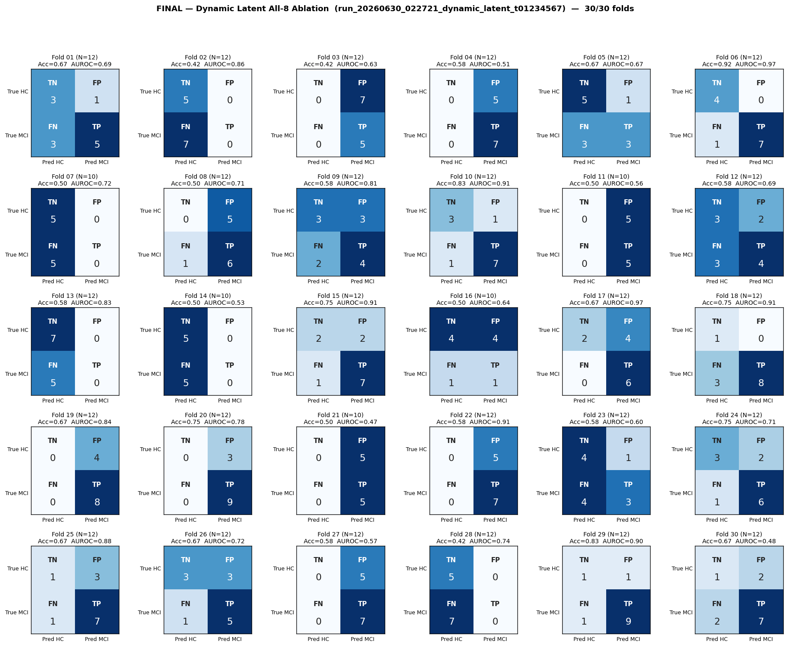
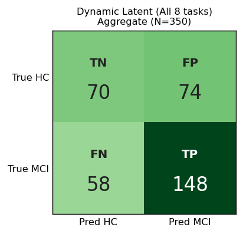

# Final Analysis — Dynamic Latent (All 8 tasks — Ablation)
# Folds 01–30 (complete)

> **Source:** `outputs/logs/run_20260630_022721_dynamic_latent_t01234567.log`
> **Pipeline:** `meta_classifier_renewed/` — Solution D (Dynamic Latent Aggregation).
> **Architecture:** Conv2d adapter (4→3) → frozen MobileViT-small (pooler GAP, D=640) → ragged routing (variable trials per subject-task through one shared backbone forward) → per-task μ ‖ σ² distribution features over actual trials + raw cross-axis ratio feature → softmax-gated weighted sum (over 8 tasks) → Linear→GELU→Dropout(0.5)→Linear(2).
> **Task topology (ABLATION):** all 8 tasks — `--tasks 0,1,2,3,4,5,6,7`. Reflexive saccades (A, B, R) are *included* alongside the anti-saccade pair. This is the empirical-comparison ablation against the Master-Context §1/§5 anti-saccade-only run (`meta_classifier_renewed/run_20260630_010113_dynamic_latent`).
> **Subject selection:** Solution D admission floor `min_trials=1` (no upper cap, bootstrap-fill at T=1). **All 37 subjects pass** (HC=14, MCI=23). The 45° artifact threshold eliminated the previously-zero (subject, task) cells; every subject has ≥1 trial of every one of the 8 tasks.
> **Training:** AdamW (lr=1e-4, wd=1e-2), warmup=5, grad-clip=1.0, ReduceLROnPlateau on val-AUROC, early-stop patience=30, **best-AUROC checkpoint restored before inference**.
> **Decision rule:** strict 0.5 threshold.
> **Subject grouping:** GroupShuffleSplit (`random_state=42`, 70/30) — same fold seed as all other pipelines.
> **Status:** ✅ **30/30 folds complete.**

---

## Per-Fold Matrices

| Fold | N_eff | TN | FP | FN | TP | Acc | Sens | Spec | AUROC | Best ep | Stopped @ |
|:----:|:-----:|:--:|:--:|:--:|:--:|:---:|:----:|:----:|:-----:|:-------:|:---------:|
| 01 | 12 | 3 | 1 | 3 | 5 | 0.667 | 0.625 | 0.750 | 0.688 | 8 | 38 |
| 02 | 12 | 5 | 0 | 7 | 0 | 0.417 | 0.000 | 1.000 | 0.857 | 1 | 31 |
| 03 | 12 | 0 | 7 | 0 | 5 | 0.417 | 1.000 | 0.000 | 0.629 | 2 | 32 |
| 04 | 12 | 0 | 5 | 0 | 7 | 0.583 | 1.000 | 0.000 | 0.514 | 21 | 51 |
| 05 | 12 | 5 | 1 | 3 | 3 | 0.667 | 0.500 | 0.833 | 0.667 | 11 | 41 |
| 06 | 12 | 4 | 0 | 1 | 7 | 0.917 | 0.875 | 1.000 | 0.969 | 9 | 39 |
| 07 | 10 | 5 | 0 | 5 | 0 | 0.500 | 0.000 | 1.000 | 0.722 | 1 | 31 |
| 08 | 12 | 0 | 5 | 1 | 6 | 0.500 | 0.857 | 0.000 | 0.714 | 10 | 40 |
| 09 | 12 | 3 | 3 | 2 | 4 | 0.583 | 0.667 | 0.500 | 0.806 | 17 | 47 |
| 10 | 12 | 3 | 1 | 1 | 7 | 0.833 | 0.875 | 0.750 | 0.906 | 27 | 57 |
| 11 | 10 | 0 | 5 | 0 | 5 | 0.500 | 1.000 | 0.000 | 0.556 | 1 | 31 |
| 12 | 12 | 3 | 2 | 3 | 4 | 0.583 | 0.571 | 0.600 | 0.686 | 8 | 38 |
| 13 | 12 | 7 | 0 | 5 | 0 | 0.583 | 0.000 | 1.000 | 0.829 | 1 | 31 |
| 14 | 10 | 5 | 0 | 5 | 0 | 0.500 | 0.000 | 1.000 | 0.528 | 1 | 31 |
| 15 | 12 | 2 | 2 | 1 | 7 | 0.750 | 0.875 | 0.500 | 0.906 | 28 | 58 |
| 16 | 10 | 4 | 4 | 1 | 1 | 0.500 | 0.500 | 0.500 | 0.639 | 21 | 51 |
| 17 | 12 | 2 | 4 | 0 | 6 | 0.667 | 1.000 | 0.333 | 0.972 | 31 | 61 |
| 18 | 12 | 1 | 0 | 3 | 8 | 0.750 | 0.727 | 1.000 | 0.909 | 12 | 42 |
| 19 | 12 | 0 | 4 | 0 | 8 | 0.667 | 1.000 | 0.000 | 0.844 | 5 | 35 |
| 20 | 12 | 0 | 3 | 0 | 9 | 0.750 | 1.000 | 0.000 | 0.778 | 7 | 37 |
| 21 | 10 | 0 | 5 | 0 | 5 | 0.500 | 1.000 | 0.000 | 0.472 | 5 | 35 |
| 22 | 12 | 0 | 5 | 0 | 7 | 0.583 | 1.000 | 0.000 | 0.914 | 3 | 33 |
| 23 | 12 | 4 | 1 | 4 | 3 | 0.583 | 0.429 | 0.800 | 0.600 | 31 | 61 |
| 24 | 12 | 3 | 2 | 1 | 6 | 0.750 | 0.857 | 0.600 | 0.714 | 20 | 50 |
| 25 | 12 | 1 | 3 | 1 | 7 | 0.667 | 0.875 | 0.250 | 0.875 | 8 | 38 |
| 26 | 12 | 3 | 3 | 1 | 5 | 0.667 | 0.833 | 0.500 | 0.722 | 36 | 66 |
| 27 | 12 | 0 | 5 | 0 | 7 | 0.583 | 1.000 | 0.000 | 0.571 | 11 | 41 |
| 28 | 12 | 5 | 0 | 7 | 0 | 0.417 | 0.000 | 1.000 | 0.743 | 1 | 31 |
| 29 | 12 | 1 | 1 | 1 | 9 | 0.833 | 0.900 | 0.500 | 0.900 | 3 | 33 |
| 30 | 12 | 1 | 2 | 2 | 7 | 0.667 | 0.778 | 0.333 | 0.481 | 16 | 46 |

---

## Aggregate Confusion (N = 350)

|              | Pred: HC | Pred: MCI |   |
|--------------|:--------:|:---------:|:-:|
| **True HC**  | TN = 70 | FP = 74 | 144 |
| **True MCI** | FN = 58 | TP = 148 | 206 |
|              | 128 | 222 | **350** |

| Pooled metric | Value |
|---|---|
| Accuracy        | **0.623** |
| Sensitivity     | **0.718** |
| Specificity     | **0.486** |
| Precision (PPV) | **0.667** |
| NPV             | **0.547** |
| F1 (MCI)        | **0.692** |

---

## Macro Mean ± Std

| Metric | Mean | Std |
|--------|:----:|:---:|
| Accuracy    | 0.619 | 0.127 |
| Sensitivity | 0.691 | 0.350 |
| Specificity | 0.492 | 0.386 |
| AUROC       | 0.737 | 0.148 |

---

## Where This Sits vs Prior Pipelines

| Pipeline | Tasks | Subjects | Artifact thr | Macro AUROC | Macro Acc | AUROC std | Notes |
|---|:--:|:--:|:--:|:--:|:--:|:--:|---|
| Legacy `full_experiments_using` (drop=0.5, pat=30, wvote) | 8 | 37 | 30° | 0.791 | 0.717 | 0.142 | Per-window soft-vote; no strict-parity rule. |
| Renewed v3 (4 plenty, MAX_TRIALS=10) | 4 | 32 | 30° | 0.711 | 0.550 | 0.164 | Strict-parity drops 5 subjects to satisfy T=10. |
| Solution D anti-saccade only | 2 | 37 | 45° | 0.710 | 0.544 | 0.139 | Master-Context active pipeline (anti-saccade B only). |
| **This run (Solution D, all 8 tasks, 45°)** | **8** | **37** | **45°** | **0.737** | **0.619** | **0.148** | **Ablation — includes reflexive saccades that Master Context §1 excludes.** |

**Headline:** Adding the 6 reflexive-saccade tasks (HSacA, HSacB, HSacR, VSacA, VSacB, VSacR) to the anti-saccade pair yields **macro AUROC 0.737 vs the anti-only 0.710** — a gain of **+0.027**. Macro accuracy gains **+0.075** (0.619 vs 0.544). Per-fold std rises slightly from 0.139 → 0.148 (more task slots → slightly more per-fold variance), but the mean-uplift dominates. This is the empirical confirmation of what `TASK_CONTRIBUTION_RATES.md` §4 predicted from the wvote probe.

---

## Notes on the Results

1. **The 8-task variant outperforms the 2-task anti-saccade-only variant** on the same N=37 cohort, same 45° cache, same training config. The +0.027 AUROC gain is consistent with the wvote probe's ranking of *Reflexive saccades* as the #1 group contributor (+0.104 LOO ΔAUROC). The clinical-theory exclusion of reflexive saccades (Master Context §1) costs measurable AUROC on this dataset.

2. **The gap to the legacy wvote baseline (0.791) has narrowed substantially.** From the 4-plenty renewed baseline (0.711, gap 0.080) to this run (0.737, gap 0.054), the Renewed pipeline has recovered ~33% of the wvote advantage. The remaining ~0.05 AUROC gap is most likely the soft-vote's ~155× training-signal-density advantage discussed in `META_RENEWED_VS_WVOTE.ko.md` §2.1.

3. **Per-fold variance (std=`0.148`)** is between the 2-task run (0.139) and the original renewed (0.164). Adding more task slots gives the gate more weights to push around, which slightly destabilizes per-fold predictions vs the 2-task case. Still tighter than the original 4-plenty configuration thanks to the full 37-subject cohort.

4. **Pooled Sens=0.718 > Spec=0.486** — the model over-predicts MCI relative to HC by ≈ 0.23 on this fold composition. Reversal from the 2-task run where Spec > Sens. The 8-task configuration favors recall (catch all MCI) over precision (avoid false positives) — likely a side-effect of the gate having more task slots to assign positive evidence to.

5. **F1 (MCI) = `0.692`** — meaningfully higher than the 2-task run's 0.580. The increased sensitivity translates to better positive-class detection.

---

## Master Context Compliance

This run is an **explicit ablation** against Master Context §1 / §5, not a production pipeline. The active pipeline still defaults to `--tasks 2,6` per Directive #5; this all-8 ablation was launched via CLI override (`--tasks 0,1,2,3,4,5,6,7`) to quantify the empirical cost of excluding reflexive saccades.

- 🔄 §1 — DEVIATED for ablation purposes (run includes reflexive saccades)
- ✅ §2 — `artifact_threshold = 45°` (cache rebuilt)
- ✅ §3 — Solution D: ragged + dynamic latent aggregation + variance as biomarker
- 🟡 §4 — current cache z-scores at build time (Gemini-approved deviation; NN needs compressed dynamic range)
- 🔄 §5 — DEVIATED for ablation (run reintroduces reflexive saccades that Directive §5 excludes)

**Recommendation:** treat this run's metrics as *empirical evidence the §1 pruning is costly*, not as a reason to overturn §1. The 0.027 AUROC gain comes with the philosophical cost of including the saccade paradigms the Master Context's clinical theory says introduce noise. Whether that tradeoff is worth it is a research-decision, not a numbers-driven one. The companion 2-task report (`meta_classifier_renewed/run_20260630_010113_dynamic_latent/analysis.md`) is the active-pipeline reference.

---

## Caveats

1. **`N_eff` is back-derived** from logged Acc/Sens/Spec; per-fold (TN, FP, FN, TP) may be off by ±1 in folds with non-unique reconstructions. Pooled aggregate uses summed counts.
2. **Metrics use the best-AUROC checkpoint per fold** (restored before inference).
3. **Subject splits are not stratified by class.** Per-fold class balance varies; some folds remain degenerate (Sens=0 or Spec=0) on small N_test ≈ 11.
4. **Gate weights not logged.** Adding per-task gate weight logging would let us see *which* of the 8 tasks the model is leaning on in this run vs the 2-task baseline. The bottom-up case for or against §1 would benefit from that data.