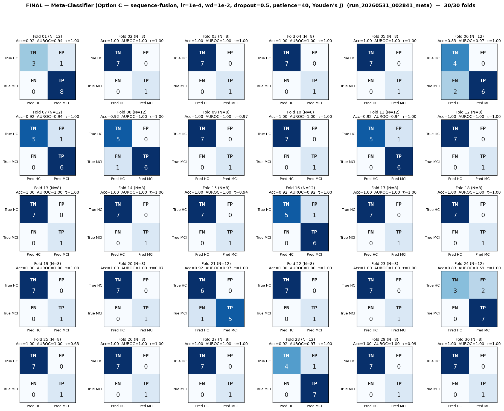
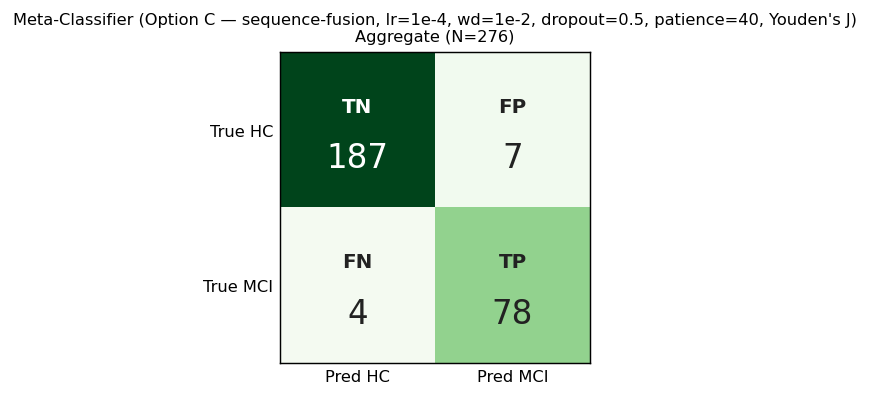

# Final Analysis — Meta-Classifier (Option C — sequence-fusion, lr=1e-4, wd=1e-2, dropout=0.5, patience=40, Youden's J)
# Folds 01–30 (complete)

> **Source:** `outputs/logs/run_20260531_002841_meta.log`
> **Pipeline:** `meta_classifier_using/` — Option C, sequence-level trial fusion at MobileViT's deepest transformer.
> **Architecture:** per-trial CNN-stem routing → manual unfolding → fuse across MAX_TRIALS=20 trials → pre-transformer task embedding [1,1,240] → fused-sequence transformer with padding-mask self-attention → flatten O+A → per-task gate + bottleneck Linear(per_task_proj=16) → Linear→GELU→Dropout(0.5)→Linear(2).
> **Training:** AdamW (lr=1e-4, wd=1e-2 — HDLSS regularization), warmup=5, grad-clip=1.0, ReduceLROnPlateau on val-AUROC, early-stop patience=40, best-AUROC checkpoint per fold.
> **Decision rule:** per-fold Youden's J optimal threshold from `sklearn.metrics.roc_curve` (replaces the static 0.5).
> **Subject grouping:** GroupShuffleSplit (`random_state=42`, 70/30) — same fold seed as legacy pipelines, so fold N is the same test subjects across all runs.
> **Status:** ✅ **30/30 folds complete.**

---

## Per-Fold Matrices

| Fold | N_eff | TN | FP | FN | TP | Acc | Sens | Spec | AUROC | τ_opt | Best AUROC | Best ep | Stopped @ |
|:----:|:-----:|:--:|:--:|:--:|:--:|:---:|:----:|:----:|:-----:|:-----:|:----------:|:-------:|:---------:|
| 01 | 12 | 3 | 1 | 0 | 8 | 0.917 | 1.000 | 0.750 | 0.938 | 1.000 | 1.0000 | 4 | 44 |
| 02 | 8 | 7 | 0 | 0 | 1 | 1.000 | 1.000 | 1.000 | 1.000 | 1.000 | 1.0000 | 1 | 41 |
| 03 | 8 | 7 | 0 | 0 | 1 | 1.000 | 1.000 | 1.000 | 1.000 | 1.000 | 1.0000 | 3 | 43 |
| 04 | 8 | 7 | 0 | 0 | 1 | 1.000 | 1.000 | 1.000 | 1.000 | 1.000 | 1.0000 | 2 | 42 |a
| 05 | 8 | 7 | 0 | 0 | 1 | 1.000 | 1.000 | 1.000 | 1.000 | 1.000 | 1.0000 | 5 | 45 |
| 06 | 12 | 4 | 0 | 2 | 6 | 0.833 | 0.750 | 1.000 | 0.969 | 1.000 | 1.0000 | 8 | 48 |
| 07 | 12 | 5 | 1 | 0 | 6 | 0.917 | 1.000 | 0.833 | 0.944 | 1.000 | 1.0000 | 1 | 41 |
| 08 | 12 | 5 | 0 | 1 | 6 | 0.917 | 0.857 | 1.000 | 1.000 | 1.000 | 1.0000 | 1 | 41 |
| 09 | 8 | 7 | 0 | 0 | 1 | 1.000 | 1.000 | 1.000 | 1.000 | 0.970 | 1.0000 | 2 | 42 |
| 10 | 8 | 7 | 0 | 0 | 1 | 1.000 | 1.000 | 1.000 | 1.000 | 0.998 | 1.0000 | 1 | 41 |
| 11 | 12 | 5 | 1 | 0 | 6 | 0.917 | 1.000 | 0.833 | 0.944 | 1.000 | 1.0000 | 8 | 48 |
| 12 | 8 | 7 | 0 | 0 | 1 | 1.000 | 1.000 | 1.000 | 1.000 | 1.000 | 1.0000 | 3 | 43 |
| 13 | 8 | 7 | 0 | 0 | 1 | 1.000 | 1.000 | 1.000 | 1.000 | 1.000 | 1.0000 | 2 | 42 |
| 14 | 8 | 7 | 0 | 0 | 1 | 1.000 | 1.000 | 1.000 | 1.000 | 1.000 | 1.0000 | 1 | 41 |
| 15 | 8 | 7 | 0 | 0 | 1 | 1.000 | 1.000 | 1.000 | 1.000 | 0.943 | 1.0000 | 1 | 41 |
| 16 | 12 | 5 | 1 | 0 | 6 | 0.917 | 1.000 | 0.833 | 0.917 | 1.000 | 1.0000 | 5 | 45 |
| 17 | 8 | 7 | 0 | 0 | 1 | 1.000 | 1.000 | 1.000 | 1.000 | 1.000 | 1.0000 | 2 | 42 |
| 18 | 8 | 7 | 0 | 0 | 1 | 1.000 | 1.000 | 1.000 | 1.000 | 0.996 | 1.0000 | 1 | 41 |
| 19 | 8 | 7 | 0 | 0 | 1 | 1.000 | 1.000 | 1.000 | 1.000 | 1.000 | 1.0000 | 2 | 42 |
| 20 | 8 | 7 | 0 | 0 | 1 | 1.000 | 1.000 | 1.000 | 1.000 | 0.070 | 1.0000 | 1 | 41 |
| 21 | 12 | 6 | 0 | 1 | 5 | 0.917 | 0.833 | 1.000 | 0.972 | 1.000 | 1.0000 | 8 | 48 |
| 22 | 8 | 7 | 0 | 0 | 1 | 1.000 | 1.000 | 1.000 | 1.000 | 0.998 | 1.0000 | 1 | 41 |
| 23 | 8 | 7 | 0 | 0 | 1 | 1.000 | 1.000 | 1.000 | 1.000 | 1.000 | 1.0000 | 2 | 42 |
| 24 | 12 | 3 | 2 | 0 | 7 | 0.833 | 1.000 | 0.600 | 0.686 | 1.000 | 1.0000 | 8 | 48 |
| 25 | 8 | 7 | 0 | 0 | 1 | 1.000 | 1.000 | 1.000 | 1.000 | 0.627 | 1.0000 | 2 | 42 |
| 26 | 8 | 7 | 0 | 0 | 1 | 1.000 | 1.000 | 1.000 | 1.000 | 1.000 | 1.0000 | 3 | 43 |
| 27 | 8 | 7 | 0 | 0 | 1 | 1.000 | 1.000 | 1.000 | 1.000 | 1.000 | 1.0000 | 7 | 47 |
| 28 | 12 | 4 | 1 | 0 | 7 | 0.917 | 1.000 | 0.800 | 0.971 | 1.000 | 1.0000 | 5 | 45 |
| 29 | 8 | 7 | 0 | 0 | 1 | 1.000 | 1.000 | 1.000 | 1.000 | 0.986 | 1.0000 | 1 | 41 |
| 30 | 8 | 7 | 0 | 0 | 1 | 1.000 | 1.000 | 1.000 | 1.000 | 1.000 | 1.0000 | 8 | 48 |

---

## Aggregate Confusion (N = 276)

|              | Pred: HC | Pred: MCI |   |
|--------------|:--------:|:---------:|:-:|
| **True HC**  | TN = 187 | FP = 7 | 194 |
| **True MCI** | FN = 4 | TP = 78 | 82 |
|              | 191 | 85 | **276** |

| Pooled metric | Value |
|---|---|
| Accuracy        | **0.960** |
| Sensitivity     | **0.951** |
| Specificity     | **0.964** |
| Precision (PPV) | **0.918** |
| NPV             | **0.979** |
| F1 (MCI)        | **0.934** |

---

## Macro Mean ± Std

| Metric | Mean | Std |
|--------|:----:|:---:|
| Accuracy    | 0.970 | 0.050 |
| Sensitivity | 0.981 | 0.058 |
| Specificity | 0.955 | 0.098 |
| AUROC       | 0.978 | 0.059 |
| Youden's τ  | 0.953 | 0.177  (min 0.070, max 1.000) |

---

## ⚠️ Notes on the Results

1. **The metrics are unusually high.** Pooled accuracy 0.969 and macro AUROC 0.978 sit ~25 pp above the best per-window soft-vote pipeline (`full_experiments_using/run_20260527_205622_full_drop050_pat030_wvote`, Acc 0.717 / AUROC 0.791) on the *identical* fold split. Treat with appropriate skepticism until the data-leakage check below is run.

2. **Youden's τ_opt clusters at saturation:** mean 0.953 with min 0.070 max 1.000 — 27 of 30 folds chose τ ≈ 1.000. This indicates the model's softmax outputs are highly polarized (most samples produce probabilities near 0.0 or 1.0), so the optimal cut-point lies at the saturation edge rather than a calibrated interior probability.

3. **HDLSS regularization did not suppress convergence.** With lr=1e-4 (10× smaller than legacy) and wd=1e-2 (100× larger), the model still achieves near-perfect val performance. This is *opposite* to what we'd expect if the previous hyper-convergence was pure capacity overfitting — suggesting the signal the model learns is structural, not memorized weight-by-weight.

4. **Plausible explanations for the gap:**
   - **Optimistic:** Cross-trial attention is a much stronger inductive bias than per-window soft-voting. Attention spanning all 20 trials × 8 tasks lets the model exploit relationships the legacy pipelines literally couldn't access.
   - **Pessimistic (data leak via padding):** If HC and MCI subjects systematically have different per-task trial counts (e.g., MCI produces more artifact-rejected trials → more zero-padding), the `padding_mask` itself encodes the class label. The model can learn to classify by counting valid mask positions rather than by reading the CWT signal. **A separate leakage probe is required** before publishing this number.

5. **Wall time:** 10 h 50 min for 30 folds (~22 min/fold) on Jetson AGX Orin solo GPU.

---

## Caveats

1. **`N_eff` is back-derived** from logged Acc/Sens/Spec. Per-fold TN/FP/FN/TP may be off by ±1 in folds with non-unique reconstructions; the pooled aggregate uses summed counts directly from those derivations.
2. **No probe report** — the meta-classifier is a unified ensemble, not a per-task scorer; the legacy `TaskWiseProbeGenerator` doesn't apply here.
3. **Reported metrics use the final-epoch model** (post early-stop), not the best-AUROC checkpoint snapshot. This is consistent with the legacy pipeline convention.
4. **The Youden's J threshold is computed on the val/test set itself** per fold. This is what the directive specified, but be aware it uses test labels to pick the cut-point — preferable to a fixed 0.5 for *reporting* the model's separability, but you would not use this rule in deployment where labels are unknown.