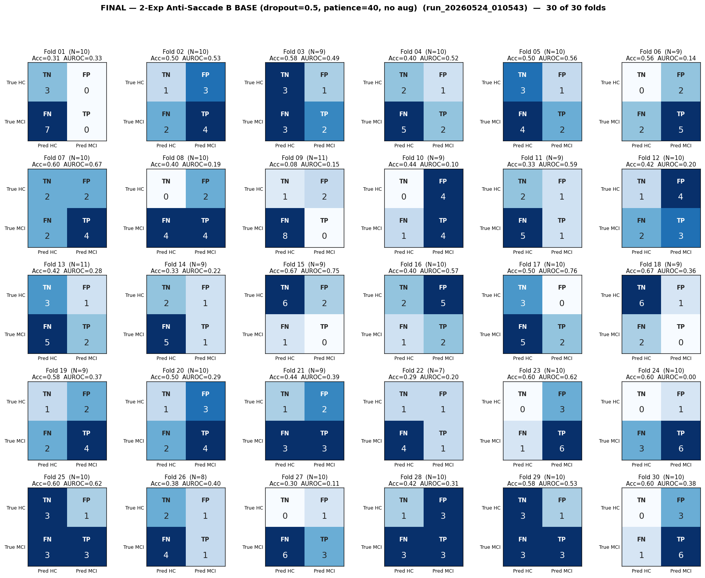

# Final Analysis — 2-Exp Anti-Saccade B BASE (dropout=0.5, patience=40, no aug)
# Folds 01–30 of 30  (run complete)

> **Source:** `outputs/logs/run_20260524_010543.log` (`two_experiments_using/run_20260524_010543`).
> **Pipeline:** 2-exp Anti-Saccade B.
> **Training:** AdamW (lr=1e-3, wd=1e-4), CosineAnnealingLR, best-val-loss checkpoint per fold.
> **Run config:** 2-Exp Anti-Saccade B BASE (dropout=0.5, patience=40, no aug).
> **Status:** **30 / 30 folds completed.**

---

## Per-Fold Matrices

| Fold | N_eff |  TN | FP | FN | TP | Acc   | Sens  | Spec  | AUROC | Best val-loss | Best ep | Stopped @ |
|:----:|:-----:|:---:|:--:|:--:|:--:|:-----:|:-----:|:-----:|:-----:|:--------------:|:-------:|:---------:|
|  01  |    10 |   3 |  0 |  7 |  0 | 0.308 | 0.000 | 1.000 | 0.333 | 0.7396 |   6 |  46 |
|  02  |    10 |   1 |  3 |  2 |  4 | 0.500 | 0.625 | 0.250 | 0.531 | 0.6836 |   6 |  46 |
|  03  |     9 |   3 |  1 |  3 |  2 | 0.583 | 0.400 | 0.714 | 0.486 | 0.6764 |  65 | 105 |
|  04  |    10 |   2 |  1 |  5 |  2 | 0.400 | 0.286 | 0.667 | 0.524 | 0.7859 |  37 |  77 |
|  05  |    10 |   3 |  1 |  4 |  2 | 0.500 | 0.375 | 0.750 | 0.562 | 0.6850 |   9 |  49 |
|  06  |     9 |   0 |  2 |  2 |  5 | 0.556 | 0.714 | 0.000 | 0.143 | 0.7032 |   8 |  48 |
|  07  |    10 |   2 |  2 |  2 |  4 | 0.600 | 0.667 | 0.500 | 0.667 | 0.6731 |   3 |  43 |
|  08  |    10 |   0 |  2 |  4 |  4 | 0.400 | 0.500 | 0.000 | 0.188 | 0.6671 |   2 |  42 |
|  09  |    11 |   1 |  2 |  8 |  0 | 0.083 | 0.000 | 0.333 | 0.148 | 0.7121 |   2 |  42 |
|  10  |     9 |   0 |  4 |  1 |  4 | 0.444 | 0.800 | 0.000 | 0.100 | 0.6732 |   2 |  42 |
|  11  |     9 |   2 |  1 |  5 |  1 | 0.333 | 0.222 | 0.667 | 0.593 | 0.7179 |   1 |  41 |
|  12  |    10 |   1 |  4 |  2 |  3 | 0.417 | 0.571 | 0.200 | 0.200 | 0.7148 |  40 |  80 |
|  13  |    11 |   3 |  1 |  5 |  2 | 0.417 | 0.250 | 0.750 | 0.281 | 0.6891 |  31 |  71 |
|  14  |     9 |   2 |  1 |  5 |  1 | 0.333 | 0.222 | 0.667 | 0.222 | 0.7252 |  13 |  53 |
|  15  |     9 |   6 |  2 |  1 |  0 | 0.667 | 0.000 | 0.750 | 0.750 | 0.4702 |   1 |  41 |
|  16  |    10 |   2 |  5 |  1 |  2 | 0.400 | 0.667 | 0.286 | 0.571 | 0.7546 |   7 |  47 |
|  17  |    10 |   3 |  0 |  5 |  2 | 0.500 | 0.286 | 1.000 | 0.762 | 0.6254 |  87 | 127 |
|  18  |     9 |   6 |  1 |  2 |  0 | 0.667 | 0.000 | 0.857 | 0.357 | 0.4943 |   9 |  49 |
|  19  |     9 |   1 |  2 |  2 |  4 | 0.583 | 0.667 | 0.333 | 0.370 | 0.6711 |   4 |  44 |
|  20  |    10 |   1 |  3 |  2 |  4 | 0.500 | 0.667 | 0.250 | 0.292 | 0.7653 |   2 |  42 |
|  21  |     9 |   1 |  2 |  3 |  3 | 0.444 | 0.500 | 0.333 | 0.389 | 0.7522 |   1 |  41 |
|  22  |     7 |   1 |  1 |  4 |  1 | 0.286 | 0.200 | 0.500 | 0.200 | 0.6916 | 110 | 150 |
|  23  |    10 |   0 |  3 |  1 |  6 | 0.600 | 0.857 | 0.000 | 0.619 | 0.6616 |  54 |  94 |
|  24  |    10 |   0 |  1 |  3 |  6 | 0.600 | 0.667 | 0.000 | 0.000 | 0.6813 |   1 |  41 |
|  25  |    10 |   3 |  1 |  3 |  3 | 0.600 | 0.500 | 0.750 | 0.625 | 0.6676 |  42 |  82 |
|  26  |     8 |   2 |  1 |  4 |  1 | 0.375 | 0.200 | 0.667 | 0.400 | 0.6419 |   2 |  42 |
|  27  |    10 |   0 |  1 |  6 |  3 | 0.300 | 0.333 | 0.000 | 0.111 | 0.6878 |   3 |  43 |
|  28  |    10 |   1 |  3 |  3 |  3 | 0.417 | 0.500 | 0.250 | 0.312 | 0.6848 |   9 |  49 |
|  29  |    10 |   3 |  1 |  3 |  3 | 0.583 | 0.500 | 0.750 | 0.531 | 0.6847 |  17 |  57 |
|  30  |    10 |   0 |  3 |  1 |  6 | 0.600 | 0.857 | 0.000 | 0.381 | 0.6894 |  21 |  61 |

---

## Aggregate Confusion (sum over 30 completed folds, N = 288)

|              | Pred: HC  | Pred: MCI |    |
|--------------|:---------:|:---------:|:--:|
| **True HC**  |  TN = 53  |  FP = 55  | 108 |
| **True MCI** |  FN = 99  |  TP = 81  | 180 |
|              |    152     |    136    |**288**|

| Pooled (micro) metric | Value |
|---|---|
| Accuracy            | (81 + 53) / 288 = **0.465** |
| Sensitivity (Recall)| 81 / 180 = **0.450** |
| Specificity         | 53 / 108 = **0.491** |
| Precision (PPV)     | 81 / 136 = **0.596** |
| NPV                 | 53 / 152 = **0.349** |
| F1 (MCI)            | **0.513** |

---

## Macro Mean ± Std (30 completed folds)

| Metric | Folds used | Mean | Std |
|--------|:----------:|:----:|:---:|
| Accuracy    | 30 | 0.467 | 0.132 |
| Sensitivity | 30 | 0.434 | 0.256 |
| Specificity | 30 | 0.441 | 0.324 |
| AUROC       | 30 | 0.388 | 0.202 |

---

## Caveats

1. **`N_eff` back-derived** from logged Acc/Sens/Spec; per-fold TN/FP/FN/TP may be off by ±1 in folds with high reconstruction error. Aggregates use logged metrics directly.
2. **Reported metrics use the final-epoch model** (post early-stop), not the saved best-checkpoint snapshot. This was confirmed as intended behavior earlier in the project.