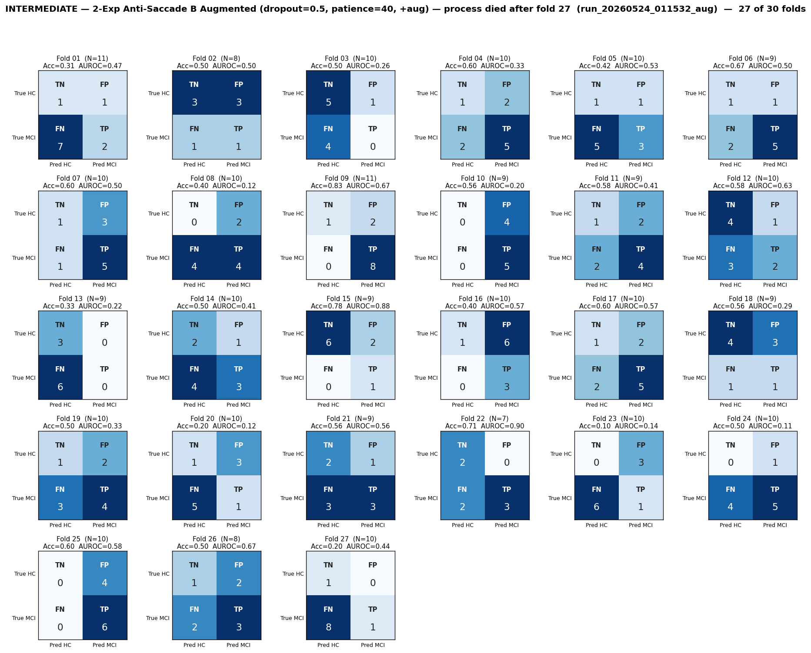

# Intermediate Analysis — 2-Exp Anti-Saccade B Augmented (dropout=0.5, patience=40, +aug) — process died after fold 27
# Folds 01–27 of 30  (run still in progress)

> **Source:** `outputs/logs/run_20260524_011532_aug.log` (`two_experiments_using/run_20260524_011532_aug`).
> **Pipeline:** 2-exp Anti-Saccade B.
> **Training:** AdamW (lr=1e-3, wd=1e-4), CosineAnnealingLR, best-val-loss checkpoint per fold.
> **Run config:** 2-Exp Anti-Saccade B Augmented (dropout=0.5, patience=40, +aug) — process died after fold 27.
> **Status:** **27 / 30 folds intermediate.**

---

## Per-Fold Matrices

| Fold | N_eff |  TN | FP | FN | TP | Acc   | Sens  | Spec  | AUROC | Best val-loss | Best ep | Stopped @ |
|:----:|:-----:|:---:|:--:|:--:|:--:|:-----:|:-----:|:-----:|:-----:|:--------------:|:-------:|:---------:|
|  01  |    11 |   1 |  1 |  7 |  2 | 0.308 | 0.222 | 0.500 | 0.472 | 0.6971 |   1 |  41 |
|  02  |     8 |   3 |  3 |  1 |  1 | 0.500 | 0.500 | 0.500 | 0.500 | 0.7011 |   5 |  45 |
|  03  |    10 |   5 |  1 |  4 |  0 | 0.500 | 0.000 | 0.857 | 0.257 | 0.6646 |  27 |  67 |
|  04  |    10 |   1 |  2 |  2 |  5 | 0.600 | 0.714 | 0.333 | 0.333 | 0.6779 |   1 |  41 |
|  05  |    10 |   1 |  1 |  5 |  3 | 0.417 | 0.375 | 0.500 | 0.531 | 0.6839 |  61 | 101 |
|  06  |     9 |   1 |  1 |  2 |  5 | 0.667 | 0.714 | 0.500 | 0.500 | 0.7103 |  25 |  65 |
|  07  |    10 |   1 |  3 |  1 |  5 | 0.600 | 0.833 | 0.250 | 0.500 | 0.7060 |   2 |  42 |
|  08  |    10 |   0 |  2 |  4 |  4 | 0.400 | 0.500 | 0.000 | 0.125 | 0.6566 |   3 |  43 |
|  09  |    11 |   1 |  2 |  0 |  8 | 0.833 | 1.000 | 0.333 | 0.667 | 0.6375 |   3 |  43 |
|  10  |     9 |   0 |  4 |  0 |  5 | 0.556 | 1.000 | 0.000 | 0.200 | 0.7220 |   3 |  43 |
|  11  |     9 |   1 |  2 |  2 |  4 | 0.583 | 0.667 | 0.333 | 0.407 | 0.7089 |  28 |  68 |
|  12  |    10 |   4 |  1 |  3 |  2 | 0.583 | 0.429 | 0.800 | 0.629 | 0.6615 |  19 |  59 |
|  13  |     9 |   3 |  0 |  6 |  0 | 0.333 | 0.000 | 1.000 | 0.219 | 0.7072 |   4 |  44 |
|  14  |    10 |   2 |  1 |  4 |  3 | 0.500 | 0.444 | 0.667 | 0.407 | 0.6738 |   4 |  44 |
|  15  |     9 |   6 |  2 |  0 |  1 | 0.778 | 1.000 | 0.750 | 0.875 | 0.6359 |  14 |  54 |
|  16  |    10 |   1 |  6 |  0 |  3 | 0.400 | 1.000 | 0.143 | 0.571 | 0.6088 |   4 |  44 |
|  17  |    10 |   1 |  2 |  2 |  5 | 0.600 | 0.714 | 0.333 | 0.571 | 0.6906 |  37 |  77 |
|  18  |     9 |   4 |  3 |  1 |  1 | 0.556 | 0.500 | 0.571 | 0.286 | 0.7502 |  53 |  93 |
|  19  |    10 |   1 |  2 |  3 |  4 | 0.500 | 0.556 | 0.333 | 0.333 | 0.6613 |   1 |  41 |
|  20  |    10 |   1 |  3 |  5 |  1 | 0.200 | 0.167 | 0.250 | 0.125 | 0.7021 |   1 |  41 |
|  21  |     9 |   2 |  1 |  3 |  3 | 0.556 | 0.500 | 0.667 | 0.556 | 0.6737 |   6 |  46 |
|  22  |     7 |   2 |  0 |  2 |  3 | 0.714 | 0.600 | 1.000 | 0.900 | 0.6181 |   6 |  46 |
|  23  |    10 |   0 |  3 |  6 |  1 | 0.100 | 0.143 | 0.000 | 0.143 | 0.7373 |  63 | 103 |
|  24  |    10 |   0 |  1 |  4 |  5 | 0.500 | 0.556 | 0.000 | 0.111 | 0.6162 |   2 |  42 |
|  25  |    10 |   0 |  4 |  0 |  6 | 0.600 | 1.000 | 0.000 | 0.583 | 0.7242 |  24 |  64 |
|  26  |     8 |   1 |  2 |  2 |  3 | 0.500 | 0.600 | 0.333 | 0.667 | 0.6124 |   8 |  48 |
|  27  |    10 |   1 |  0 |  8 |  1 | 0.200 | 0.111 | 1.000 | 0.444 | 0.6997 |   5 |  45 |

---

## Aggregate Confusion (sum over 27 intermediate folds, N = 258)

|              | Pred: HC  | Pred: MCI |    |
|--------------|:---------:|:---------:|:--:|
| **True HC**  |  TN = 44  |  FP = 53  | 97 |
| **True MCI** |  FN = 77  |  TP = 84  | 161 |
|              |    121     |    137    |**258**|

| Pooled (micro) metric | Value |
|---|---|
| Accuracy            | (84 + 44) / 258 = **0.496** |
| Sensitivity (Recall)| 84 / 161 = **0.522** |
| Specificity         | 44 / 97 = **0.454** |
| Precision (PPV)     | 84 / 137 = **0.613** |
| NPV                 | 44 / 121 = **0.364** |
| F1 (MCI)            | **0.564** |

---

## Macro Mean ± Std (27 intermediate folds)

| Metric | Folds used | Mean | Std |
|--------|:----------:|:----:|:---:|
| Accuracy    | 27 | 0.503 | 0.167 |
| Sensitivity | 27 | 0.550 | 0.303 |
| Specificity | 27 | 0.443 | 0.315 |
| AUROC       | 27 | 0.441 | 0.212 |

---

## Caveats

1. ⚠️ **Only 27 of 30 folds are in.** With small sample, single-fold variance dominates the Std column — macro Std will shrink as more folds finish. Don't treat these numbers as final.
2. **`N_eff` back-derived** from logged Acc/Sens/Spec; per-fold TN/FP/FN/TP may be off by ±1 in folds with high reconstruction error. Aggregates use logged metrics directly.
3. **Reported metrics use the final-epoch model** (post early-stop), not the saved best-checkpoint snapshot. This was confirmed as intended behavior earlier in the project.
4. **GPU contention is active** — this run shares the GPU with other concurrent runs during this snapshot.
5. **Probe report not yet generated** — `TaskWiseProbeGenerator.generate_markdown_report()` is called only after the 30-fold lifecycle ends.